# Design and Development of a Digital Observatory for Academic and Professional Integration Indicators at ISET Tozeur

[LOGO: ISET Tozeur logo here]

**Ministry of Higher Education and Scientific Research**

**ISET Tozeur — Department of Information Technology**

---

**Report Title:** Design and Development of a Digital Observatory for Academic and Professional Integration Indicators at ISET Tozeur

**Author:** [Student Name]

**Supervisors:**
- [Supervisor 1 Name], [Title]
- [Supervisor 2 Name], [Title]

**Host Organisation:** ISET Tozeur — 4C Cell (Cellule de Conseil, de Communication et de Coopération)

**Date:** June 2026

**Academic Year:** 2025–2026

---

## Abstract

This report presents the design and development of a Digital Observatory for Academic and Professional Integration Indicators for ISET Tozeur. The institute faces significant challenges in tracking and analysing graduate employment outcomes, student academic performance, and institutional indicators due to fragmented data storage across multiple disconnected systems (Excel spreadsheets, PDFs, emails, and paper records). The proposed solution is a full-stack web platform that centralises data ingestion, analysis, and visualisation within a single unified system. Built with React 19, TypeScript, Ant Design 6, and Chart.js on the frontend, and Express 4, PostgreSQL 15, and Groq AI on the backend, the platform implements a schema-agnostic data import engine that accepts any CSV or Excel file, dynamically creates PostgreSQL tables, and exposes the data through interactive dashboards. Key features include natural language querying powered by Groq AI (LLaMA 3.3 70B), a drag-and-drop dashboard canvas, an AI-assisted survey generator, role-based access control with granular permissions, and a client portal for students and alumni. The system was developed using an Agile methodology with 13 development phases tracked through GitHub milestones and issues. The platform is containerised with Docker Compose for easy deployment and is accessible via Railway and Vercel. This project demonstrates how modern web technologies and AI integration can transform institutional data management, enabling evidence-based decision-making for academic and professional integration monitoring.

**Keywords:** Digital Observatory, Data Integration, AI Analytics, Dashboard, RBAC, PostgreSQL, React, ISET Tozeur

---

## Table of Contents

(Will be added manually)

---

## List of Figures

(This list will be generated automatically by the word processor — placeholder only)

---

## List of Tables

(This list will be generated automatically — placeholder only)

---

## Acronyms

| Acronym | Full Form |
|---------|-----------|
| 4C | Cellule de Conseil, de Communication et de Coopération |
| AI | Artificial Intelligence |
| API | Application Programming Interface |
| CSV | Comma-Separated Values |
| DDL | Data Definition Language |
| ER | Entity-Relationship |
| FK | Foreign Key |
| HMR | Hot Module Replacement |
| ISET | Institut Supérieur des Études Technologiques |
| JSON | JavaScript Object Notation |
| JWT | JSON Web Token |
| KPI | Key Performance Indicator |
| NL | Natural Language |
| PFE | Projet de Fin d'Études |
| PK | Primary Key |
| QR | Quick Response |
| RBAC | Role-Based Access Control |
| REST | Representational State Transfer |
| SDK | Software Development Kit |
| SQL | Structured Query Language |
| SPA | Single Page Application |
| TLS | Transport Layer Security |
| UML | Unified Modeling Language |
| URL | Uniform Resource Locator |
| VPS | Virtual Private Server |

---

## Introduction

### Context

ISET Tozeur (Institut Supérieur des Études Technologiques de Tozeur) is a public higher education institution in southern Tunisia, offering undergraduate degrees in various technological fields. The institute's 4C Cell (Cellule de Conseil, de Communication et de Coopération) is responsible for monitoring graduate employment outcomes, tracking student academic performance, and producing institutional reports.

### Problem Statement

Currently, data related to graduate employment, student academic records, and institutional indicators is stored across multiple disconnected systems: Excel spreadsheets on individual computers, PDF reports, emails, and paper records. This fragmentation creates several critical problems:

- **Data silos**: Information cannot be cross-referenced across sources.
- **Manual effort**: Generating reports requires manually gathering data from multiple sources, a process that can take days or weeks.
- **Inconsistency**: Different staff members maintain data in different formats, leading to discrepancies.
- **Limited analysis**: Without centralised data, it is impossible to perform trend analysis or generate predictive insights.
- **No self-service access**: Students and alumni have no way to view their own data or track their progress.

### What Is a Digital Observatory?

A digital observatory is a centralised platform that collects, processes, analyses, and visualises data from multiple sources to provide actionable insights and support decision-making. Examples include:

- **The OECD Data Observatory**: Tracks economic and social indicators across member countries.
- **The Global Forest Watch**: Monitors deforestation using satellite data and crowd-sourced reports.
- **The UNESCO Observatory**: Tracks global education indicators.

In the context of ISET Tozeur, a digital observatory serves as an institutional intelligence platform, consolidating academic and professional integration data into a single, interactive, and queryable system.

### Proposed Solution

The proposed solution is a **full-stack Digital Observatory Platform** that:

1. Provides a **schema-agnostic data import engine** that accepts any CSV or Excel file, allowing administrators to upload data without writing any code.
2. Offers **AI-powered natural language querying** so that non-technical users can ask questions about their data in plain English.
3. Includes an **interactive chart builder and dashboard canvas** for creating custom visualisations and reports.
4. Implements **role-based access control** with granular permissions for secure, multi-user operation.
5. Provides a **client portal** for students and alumni to access their own data and published reports.
6. Supports **survey generation and publishing** for collecting feedback from graduates.

### Scope

The scope of this project includes:

- **Backend**: A RESTful API built with Express 4 and TypeScript, connected to a PostgreSQL 15 database.
- **Frontend**: A single-page application built with React 19, TypeScript, Vite, and Ant Design 6.
- **AI Integration**: Integration with Groq AI (LLaMA 3.3 70B model) for natural language querying and survey generation.
- **Authentication**: JWT-based authentication with bcryptjs password hashing.
- **Deployment**: Docker Compose for local development, Railway for backend hosting, and Vercel for frontend hosting.
- **Internationalisation**: Full French and English language support (French as default, English as fallback).

### Report Organisation

This report is organised into six chapters:

- **Chapter 1** presents the project context and problem analysis.
- **Chapter 2** details the functional and non-functional requirements.
- **Chapter 3** describes the system design, including architecture, technology stack, and UML diagrams.
- **Chapter 4** covers the implementation, including the development workflow, backend, frontend, and database schema.
- **Chapter 5** discusses testing and validation strategies.
- **Chapter 6** concludes with a summary of achievements, limitations, and future work.

---

## Chapter 1: Project Context and Problem Analysis

### 1.1 Host Organisation: ISET Tozeur and the 4C Cell

ISET Tozeur is one of Tunisia's Institutes of Higher Technological Studies (ISETs), a network of 24 institutes across the country that offer applied bachelor's degrees (Licences Appliquées) in engineering, business, and信息技术 fields. ISET Tozeur specifically serves the Tozeur governorate, a region in southwestern Tunisia with a population of approximately 150,000.

The **4C Cell** (Cellule de Conseil, de Communication et de Coopération) is a dedicated unit within ISET Tozeur responsible for:

- Tracking graduate employment outcomes and professional integration.
- Managing relationships with industry partners and employers.
- Organising career fairs and professional development events.
- Producing institutional reports on graduate employment rates.
- Advising students on career paths and further study options.

The 4C Cell operates with a small team of administrative staff who manually manage data from multiple sources, including paper surveys, emails from graduates, phone calls, and Excel spreadsheets maintained by different departments.

### 1.2 Problem Statement

The current data management approach at ISET Tozeur suffers from severe fragmentation, as summarised in Table 1.1.

**Table 1.1: Current data fragmentation at ISET Tozeur**

| Data Type | Current Storage | Consequences |
|-----------|----------------|--------------|
| Graduate employment data | Paper surveys + Excel files | Cannot be queried or cross-referenced; manual counting for statistics |
| Student course results | Departmental Excel files | No consolidated view of student performance |
| Alumni contact information | Email threads + phone lists | Outdated information; no self-service updating |
| Employer partnership data | Individual staff records | No central directory; knowledge lost when staff leave |
| Institutional KPIs | Manual reports | Weeks of effort to produce annual reports |
| Survey responses | Paper forms | No digital analysis; difficult to track trends over time |

The core issue is that ISET Tozeur lacks a **unified data platform** that can:

1. **Ingest data** from diverse sources without requiring technical expertise.
2. **Store data** in a structured, queryable format.
3. **Analyse data** using both traditional statistical methods and modern AI techniques.
4. **Visualise data** through interactive dashboards and reports.
5. **Share data** with different stakeholder groups (administrators, faculty, students, alumni) with appropriate access controls.

### 1.3 Proposed Solution: Digital Observatory Platform

The proposed Digital Observatory Platform addresses these challenges through the following key capabilities:

1. **Schema-Agnostic Data Import**: Administrators upload any CSV or Excel file, interactively map columns to SQL data types via a visual workspace, and the system auto-creates PostgreSQL tables — no hand-written migrations required.

2. **Natural Language Query Engine**: Powered by Groq AI (LLaMA 3.3 70B), users ask questions in plain English (e.g., "What is the average GPA by department?"). The AI generates safe, read-only SQL, executes it, and returns results with natural-language insights.

3. **Interactive Dashboards and Charts**: A chart builder supporting 10 chart types (bar, horizontal bar, line, pie, doughnut, radar, polar area, scatter, bubble, area) and a drag-and-drop dashboard canvas for composing multi-chart views that can be exported as PDF.

4. **Role-Based Access Control**: Six built-in roles (super_admin, admin, teacher, analyst, viewer, student, alumni) with 25+ granular permissions covering every resource type.

5. **Client Portal and Public Pages**: Students and alumni log in to view personal performance reports and published dashboards. Public pages allow anonymous access to selected dashboards and reports.

6. **Survey System**: AI generates structured surveys from goal descriptions. Surveys can be published with public URLs and QR codes for distribution to graduates and employers.

### 1.4 Comparison with Existing Solutions

**Table 1.2: Comparison of existing solutions vs. proposed platform**

| Feature | Excel/Spreadsheets | Google Forms + Sheets | Power BI / Tableau | Proposed Observatory |
|---------|-------------------|----------------------|-------------------|---------------------|
| Data ingestion | Manual entry | Form-based only | Connectors required | Any CSV/Excel (schema-agnostic) |
| AI natural language queries | ✗ | ✗ | Limited (Copilot) | Full NL-to-SQL (Groq AI) |
| Dashboard customisation | Limited | ✗ | Extensive | Moderate (growing) |
| Role-based access | ✗ | Limited | Enterprise | Full RBAC |
| Client/student portal | ✗ | ✗ | ✗ | Built-in |
| Survey generation | ✗ | Manual | ✗ | AI-assisted |
| Cost | Free | Free | Expensive | Open-source (MIT) |
| Deployment | Desktop | Cloud | Cloud/On-prem | Docker/Cloud |

The proposed observatory occupies a unique niche: it is an **open-source, schema-agnostic data engine** that combines the flexibility of spreadsheets with the power of AI-driven analytics, all within a secure, multi-tenant web platform.

---

## Chapter 2: Requirements Analysis

### 2.1 Functional Requirements

**Table 2.1: Functional requirements**

| ID | Feature | Description | Priority |
|----|---------|-------------|----------|
| FR-01 | User authentication | Staff login via email/password; client login via username/password | High |
| FR-02 | File upload | Upload CSV, XLS, XLSX files | High |
| FR-03 | Column mapping | Visual mapping of file columns to SQL types (TEXT, INTEGER, NUMERIC, DATE, BOOLEAN) | High |
| FR-04 | Dynamic table creation | Auto-create PostgreSQL tables from mapping | High |
| FR-05 | Data preview | Preview parsed data before import | High |
| FR-06 | Database explorer | Browse all dynamic tables with metadata | High |
| FR-07 | Table editor | CRUD operations on table rows; inline editing | High |
| FR-08 | Schema editor | Rename columns, change types, drop tables | High |
| FR-09 | AI natural language query | Ask questions in plain English; get SQL + results + insights | High |
| FR-10 | AI survey generator | Describe a survey goal; AI returns structured survey | High |
| FR-11 | Chart builder | 10 chart types with column selection and aggregation | High |
| FR-12 | Dashboard canvas | Drag-and-drop chart layout; export PDF | High |
| FR-13 | RBAC | Roles, permissions, user-role assignment | High |
| FR-14 | User management | CRUD for staff users | High |
| FR-15 | Client management | CRUD for student/alumni users | High |
| FR-16 | AI report generation | Generate performance reports via AI | High |
| FR-17 | Client portal | Students/alumni view reports and dashboards | High |
| FR-18 | Public pages | Anonymous access to published dashboards/reports | Medium |
| FR-19 | Survey publishing | Public URLs and QR codes for surveys | Medium |
| FR-20 | Survey responses | Collect and view survey answers | Medium |
| FR-21 | Notification system | In-app notifications with bell icon | Medium |
| FR-22 | Saved SQL queries | Save, execute, and manage custom queries | Medium |
| FR-23 | Foreign key management | Link dynamic tables via foreign keys | Medium |
| FR-24 | Data profiling | Column statistics (null count, unique count, min, max, avg) | Medium |
| FR-25 | Internationalisation | French/English language switching | Medium |
| FR-26 | Data export | Export table data as CSV or JSON | Low |
| FR-27 | Chart export | Export charts as PNG or JSON | Low |
| FR-28 | Bulk client import | Import clients from CSV with column mapping | Low |

### 2.2 Non-Functional Requirements

**Table 2.2: Non-functional requirements**

| Category | Requirement | Acceptance Metric |
|----------|-------------|-------------------|
| Performance | Page load time under 2 seconds | Lighthouse score > 80 |
| Performance | API response time under 500ms for standard queries | Average response time |
| Performance | AI query response under 10 seconds | Average Groq API round-trip |
| Security | Passwords hashed with bcrypt (10 rounds) | Not stored in plaintext |
| Security | JWT tokens with configurable expiry (default 24h) | Token refresh mechanism |
| Security | SQL injection prevention | Parameterised queries on all endpoints |
| Security | No public registration | All accounts by admin |
| Security | CORS restriction to configured origins | Only allowed origins |
| Availability | 99.9% uptime for core services | Health check endpoints |
| Scalability | Horizontal scaling via Docker Compose | Stateless backend design |
| Usability | French as default language | i18n framework |
| Maintainability | Automated migrations on startup | Migration tracking table |
| Portability | Docker Compose deployment | Single command startup |
| Accessibility | Keyboard navigation support | aria-labels on interactive elements |
| Error handling | Graceful error display | ErrorBoundary component |

### 2.3 User Roles and Permissions Matrix

**Table 2.3: Roles and permissions matrix**

| Permission | super_admin | admin | teacher | analyst | viewer | student | alumni |
|------------|-------------|-------|---------|---------|--------|---------|--------|
| users.view | ✓ | ✓ | ✗ | ✗ | ✗ | ✗ | ✗ |
| users.create | ✓ | ✓ | ✗ | ✗ | ✗ | ✗ | ✗ |
| users.edit | ✓ | ✓ | ✗ | ✗ | ✗ | ✗ | ✗ |
| users.delete | ✓ | ✓ | ✗ | ✗ | ✗ | ✗ | ✗ |
| roles.view | ✓ | ✓ | ✗ | ✗ | ✗ | ✗ | ✗ |
| roles.create | ✓ | ✓ | ✗ | ✗ | ✗ | ✗ | ✗ |
| roles.edit | ✓ | ✓ | ✗ | ✗ | ✗ | ✗ | ✗ |
| roles.delete | ✓ | ✗ | ✗ | ✗ | ✗ | ✗ | ✗ |
| data.import | ✓ | ✓ | ✓ | ✗ | ✗ | ✗ | ✗ |
| data.view | ✓ | ✓ | ✓ | ✓ | ✓ | ✗ | ✗ |
| data.delete | ✓ | ✓ | ✗ | ✗ | ✗ | ✗ | ✗ |
| analytics.view | ✓ | ✓ | ✓ | ✓ | ✓ | ✗ | ✗ |
| analytics.create | ✓ | ✓ | ✓ | ✓ | ✗ | ✗ | ✗ |
| ai.query | ✓ | ✓ | ✓ | ✓ | ✗ | ✗ | ✗ |
| surveys.view | ✓ | ✓ | ✓ | ✓ | ✓ | ✗ | ✗ |
| surveys.create | ✓ | ✓ | ✓ | ✗ | ✗ | ✗ | ✗ |
| surveys.manage | ✓ | ✓ | ✓ | ✗ | ✗ | ✗ | ✗ |
| clients.view | ✓ | ✓ | ✓ | ✗ | ✗ | ✗ | ✗ |
| clients.create | ✓ | ✓ | ✓ | ✗ | ✗ | ✗ | ✗ |
| clients.edit | ✓ | ✓ | ✗ | ✗ | ✗ | ✗ | ✗ |
| clients.delete | ✓ | ✓ | ✗ | ✗ | ✗ | ✗ | ✗ |
| clients.import | ✓ | ✓ | ✗ | ✗ | ✗ | ✗ | ✗ |
| reports.generate | ✓ | ✓ | ✓ | ✗ | ✗ | ✗ | ✗ |
| reports.view | ✓ | ✓ | ✓ | ✗ | ✗ | ✗ | ✗ |
| dashboards.publish | ✓ | ✓ | ✗ | ✗ | ✗ | ✗ | ✗ |

**Client roles** (student, alumni) authenticate via a separate `clients` table and have access only to their own portal (`/portal`), public dashboards, and public surveys. They cannot access any staff API endpoints.

---

## Chapter 3: System Design

### 3.1 Software Architecture

The system follows a three-tier architecture with a clear separation of concerns:

```
┌─────────────────────────────────────────────────────────────┐
│                    Browser (React 19 SPA)                    │
│                                                              │
│  ┌───────────┐ ┌──────────┐ ┌──────────────┐ ┌───────────┐ │
│  │ThemeContext│ │AuthCtx   │ │NotifContext  │ │  Router    │ │
│  │(ConfigProv│ │(JWT,User)│ │(Bell,Read)   │ │(React-     │ │
│  │ 5 schemes │ │          │ │              │ │ Router v7) │ │
│  │ light/dark│ │          │ │              │ │            │ │
│  └─────┬─────┘ └────┬─────┘ └──────┬───────┘ └─────┬─────┘ │
│        │            │              │               │        │
│  ┌─────▼────────────▼──────────────▼───────────────▼──────┐ │
│  │               Ant Design Components                     │ │
│  │                                                         │ │
│  │ Pages (20 routes): /dashboard /import /explore /ai      │ │
│  │ /charts /dashboards /surveys /users /roles /clients    │ │
│  │ /reports /portal /settings /queries /relations etc.    │ │
│  └─────────────────────┬───────────────────────────────────┘ │
└────────────────────────┼─────────────────────────────────────┘
                         │ Axios HTTP (JWT in Authorization header)
                         ▼
┌─────────────────────────────────────────────────────────────┐
│                Express 4 Backend (Port 5000)                  │
│                                                              │
│  ┌──────────┐ ┌──────────┐ ┌──────────┐ ┌────────────────┐ │
│  │ Auth     │ │ Datasets │ │ AI       │ │ Charts/Dashbd  │ │
│  │ Routes   │ │ Routes   │ │ Routes   │ │ Routes         │ │
│  └────┬─────┘ └────┬─────┘ └────┬─────┘ └──────┬─────────┘ │
│       │            │            │               │           │
│  ┌────▼────────────▼────────────▼───────────────▼─────────┐ │
│  │ Services: AI (Groq), Parser (CSV/Excel), TableBuilder   │ │
│  │ Middleware: JWT Auth, RBAC, Multer, Error Handler       │ │
│  └───────────────────────┬─────────────────────────────────┘ │
│                          │                                    │
│  ┌───────────────────────▼─────────────────────────────────┐ │
│  │           PostgreSQL 15 (Docker Volume)                  │ │
│  │ Tables: users, roles, permissions, role_permissions,    │ │
│  │ user_roles, datasets, charts, dashboards, surveys,      │ │
│  │ ai_queries, foreign_keys, saved_queries, notifications, │ │
│  │ clients, reports, survey_responses                      │ │
│  └─────────────────────────────────────────────────────────┘ │
└─────────────────────────────────────────────────────────────┘
```


> **Description:** The three-tier architecture diagram shows the React 19 frontend with Ant Design components, the Express 4 backend with its service layer, and the PostgreSQL 15 database, connected via Axios HTTP with JWT authentication.

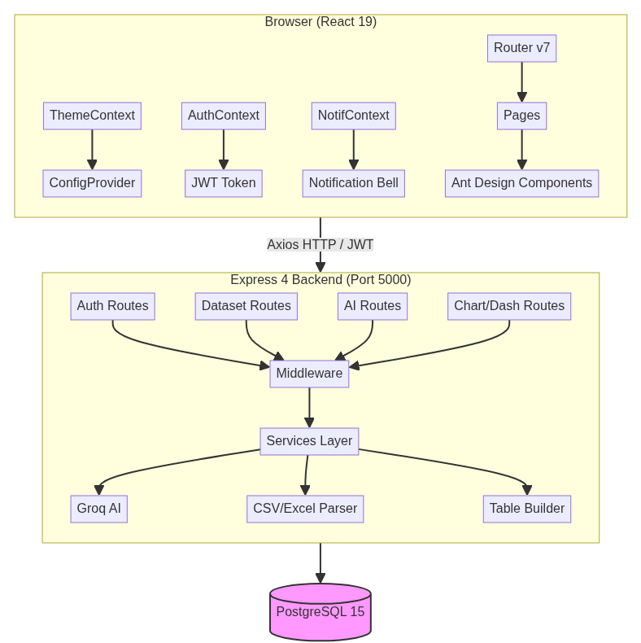
**Figure 3.1: Three-tier architecture**
**Figure 3.1: Three-tier architecture**


### 3.2 Technology Stack

**Table 3.1: Technology stack with justifications**

| Layer | Technology | Version | Justification |
|-------|-----------|---------|---------------|
| Frontend Framework | React | 19.2 | Component-based architecture, large ecosystem, HMR for rapid development |
| Frontend Language | TypeScript | 5.9 | Type safety, better IDE support, catches errors at compile time |
| Build Tool | Vite | 7.3 | Fast HMR, optimized builds, native ESM support |
| UI Library | Ant Design | 6.3 | Comprehensive component library, theming API, i18n support, responsive |
| Charting | Chart.js | 4.5 | Lightweight, 10+ chart types, reactive, good performance |
| Drag & Drop | @dnd-kit | 6.3 | Modern, accessible, flexible DnD for dashboard canvas |
| PDF Export | jsPDF | 4.2 | Client-side PDF generation without server dependencies |
| HTTP Client | Axios | 1.13 | Interceptors for JWT, request/response transformation |
| Backend Framework | Express | 4.21 | Minimalist, well-tested, large middleware ecosystem |
| Backend Language | TypeScript | 5.7 | Shared types between client/server, type safety |
| Database | PostgreSQL | 15 | Advanced features (JSONB, full-text search, extensions), reliability |
| Database Driver | pg | 8.13 | Native PostgreSQL driver, pool management, parameterised queries |
| AI Provider | Groq SDK | 0.37 | Fast inference, generous free tier, LLaMA 3.3 70B model |
| Authentication | jsonwebtoken | 9.0 | Stateless JWT, standard implementation |
| Password Hashing | bcryptjs | 2.4 | Industry-standard hashing with configurable rounds |
| File Upload | multer | 2.1 | Multipart form data handling |
| CSV Parsing | papaparse | 5.5 | Robust CSV parser with auto-detection |
| Excel Parsing | exceljs | 4.4 | XLSX reading/writing with type preservation |
| Containerisation | Docker Compose | v2 | Multi-service orchestration, environment management |
| Backend Hosting (prod) | Railway | — | Docker-native deployment, managed PostgreSQL |
| Frontend Hosting (prod) | Vercel | — | CDN-based SPA hosting, automatic HTTPS |

### 3.3 Data Model (MCD)

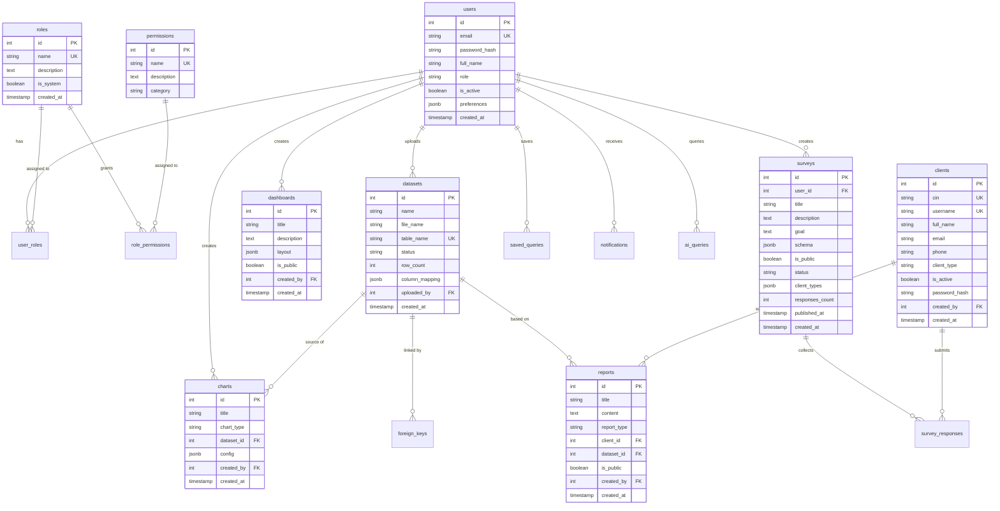
```mermaid
erDiagram
    users ||--o{ user_roles : "has"
    roles ||--o{ user_roles : "assigned to"
    roles ||--o{ role_permissions : "grants"
    permissions ||--o{ role_permissions : "assigned to"
    users ||--o{ datasets : "uploads"
    users ||--o{ charts : "creates"
    users ||--o{ dashboards : "creates"
    users ||--o{ surveys : "creates"
    users ||--o{ saved_queries : "saves"
    users ||--o{ notifications : "receives"
    users ||--o{ ai_queries : "queries"
    datasets ||--o{ charts : "source of"
    datasets ||--o{ foreign_keys : "linked by"
    datasets ||--o{ reports : "based on"
    clients ||--o{ reports : "subject of"
    surveys ||--o{ survey_responses : "collects"
    clients ||--o{ survey_responses : "submits"

    users {
        int id PK
        string email UK
        string password_hash
        string full_name
        string role
        boolean is_active
        jsonb preferences
        timestamp created_at
    }

    roles {
        int id PK
        string name UK
        text description
        boolean is_system
        timestamp created_at
    }

    permissions {
        int id PK
        string name UK
        text description
        string category
    }

    datasets {
        int id PK
        string name
        string file_name
        string table_name UK
        string status
        int row_count
        jsonb column_mapping
        int uploaded_by FK
        timestamp created_at
    }

    charts {
        int id PK
        string title
        string chart_type
        int dataset_id FK
        jsonb config
        int created_by FK
        timestamp created_at
    }

    dashboards {
        int id PK
        string title
        text description
        jsonb layout
        boolean is_public
        int created_by FK
        timestamp created_at
    }

    surveys {
        int id PK
        int user_id FK
        string title
        text description
        text goal
        jsonb schema
        boolean is_public
        string status
        jsonb client_types
        int responses_count
        timestamp published_at
        timestamp created_at
    }

    clients {
        int id PK
        string cin UK
        string username UK
        string full_name
        string email
        string phone
        string client_type
        boolean is_active
        string password_hash
        int created_by FK
        timestamp created_at
    }

    reports {
        int id PK
        string title
        text content
        string report_type
        int client_id FK
        int dataset_id FK
        boolean is_public
        int created_by FK
        timestamp created_at
    }
```


> **Description:** The Entity-Relationship diagram maps all 15 database tables with their column types, primary keys, foreign key relationships, and cascade deletion rules for maintaining referential integrity.

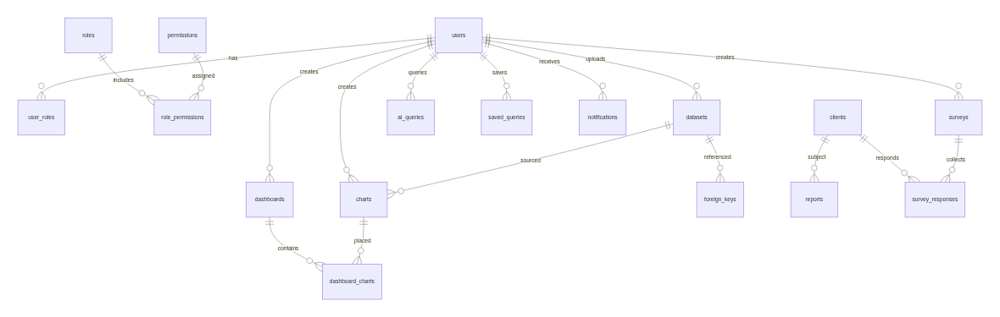
**Figure 3.2: Entity-Relationship diagram**
**Figure 3.2: Entity-Relationship diagram**

### 3.4 UML Diagrams

#### 3.4.1 Use Case Diagram

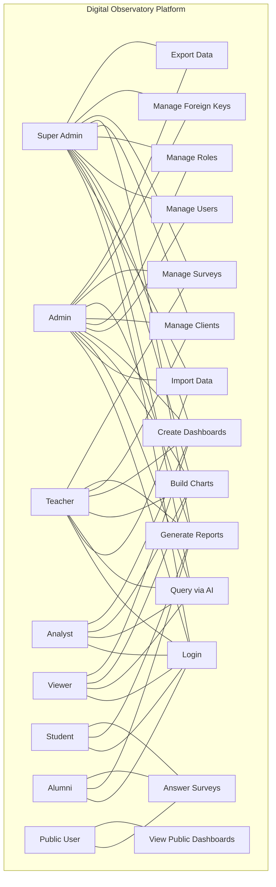
```mermaid
flowchart TD
    subgraph "Digital Observatory Platform"
        %% Use cases
        UC1["Login"]
        UC2["Import Data"]
        UC3["Query via AI"]
        UC4["Build Charts"]
        UC5["Create Dashboards"]
        UC6["Manage Users"]
        UC7["Manage Roles"]
        UC8["Manage Clients"]
        UC9["Generate Reports"]
        UC10["Answer Surveys"]
        UC11["View Public Dashboards"]
        UC12["Manage Surveys"]
        UC13["Manage Foreign Keys"]
        UC14["Export Data"]

        %% Actors
        SA["Super Admin"]
        AD["Admin"]
        TE["Teacher"]
        AN["Analyst"]
        VI["Viewer"]
        ST["Student"]
        AL["Alumni"]
        PU["Public User"]

        %% Relationships
        SA --- UC1 & UC2 & UC3 & UC4 & UC5 & UC6 & UC7 & UC8 & UC9 & UC12 & UC13 & UC14
        AD --- UC1 & UC2 & UC3 & UC4 & UC5 & UC6 & UC7 & UC8 & UC9 & UC12 & UC13 & UC14
        TE --- UC1 & UC2 & UC3 & UC4 & UC5 & UC8 & UC9 & UC12
        AN --- UC1 & UC3 & UC4 & UC5
        VI --- UC1 & UC3 & UC4 & UC5
        ST --- UC1 & UC9 & UC10
        AL --- UC1 & UC9 & UC10
        PU --- UC10 & UC11
    end
```


> **Description:** The use case diagram identifies seven actor types (Super Admin through Public User) mapped to 14 core use cases including data import, AI querying, chart building, dashboard creation, and survey management.

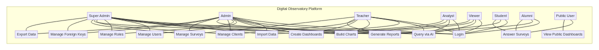
**Figure 3.3: Use case diagram**
**Figure 3.3: Use case diagram**

#### 3.4.2 Class Diagram (Core Entities)

> **Description:** The class diagram defines the core entity model with ten primary classes (User, Role, Permission, Dataset, Chart, Dashboard, Client, Report, Survey, SurveyResponse) and their relationships, including many-to-many role-permission assignments and one-to-many ownership links between users and their created resources.

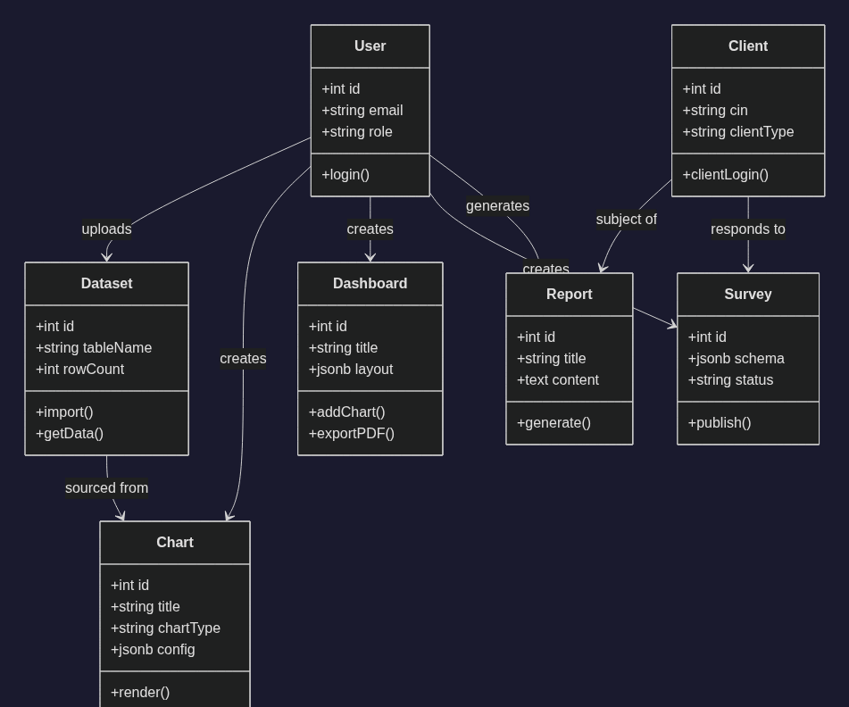
**Figure 3.4: Class diagram of core entities**
**Figure 3.4: Class diagram of core entities**

The mermaid source code for this class diagram is included in the project source as reference:


#### 3.4.3 Sequence Diagrams

**Authentication Sequence**

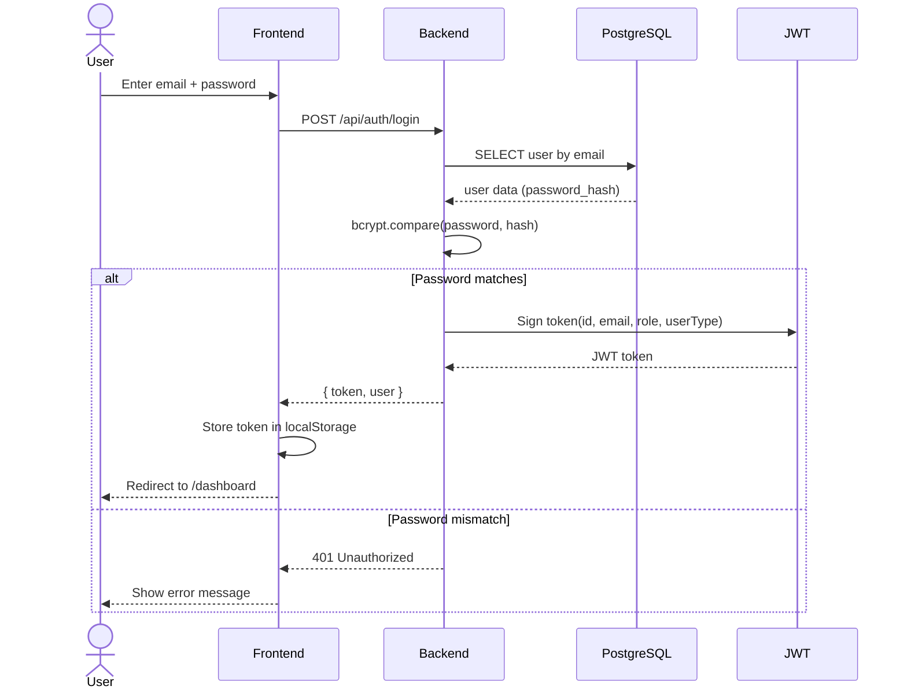
```mermaid
sequenceDiagram
    actor User
    participant Frontend
    participant Backend
    participant DB as PostgreSQL
    participant JWT

    User->>Frontend: Enter email + password
    Frontend->>Backend: POST /api/auth/login
    Backend->>DB: SELECT user by email
    DB-->>Backend: user data (password_hash)
    Backend->>Backend: bcrypt.compare(password, hash)
    alt Password matches
        Backend->>JWT: Sign token(id, email, role, userType)
        JWT-->>Backend: JWT token
        Backend-->>Frontend: { token, user }
        Frontend->>Frontend: Store token in localStorage
        Frontend-->>User: Redirect to /dashboard
    else Password mismatch
        Backend-->>Frontend: 401 Unauthorized
        Frontend-->>User: Show error message
    end
```


> **Description:** The authentication sequence diagram details the JWT login flow: credential submission, bcrypt password verification, token signing with user context, localStorage persistence, and 401 error handling on mismatch.

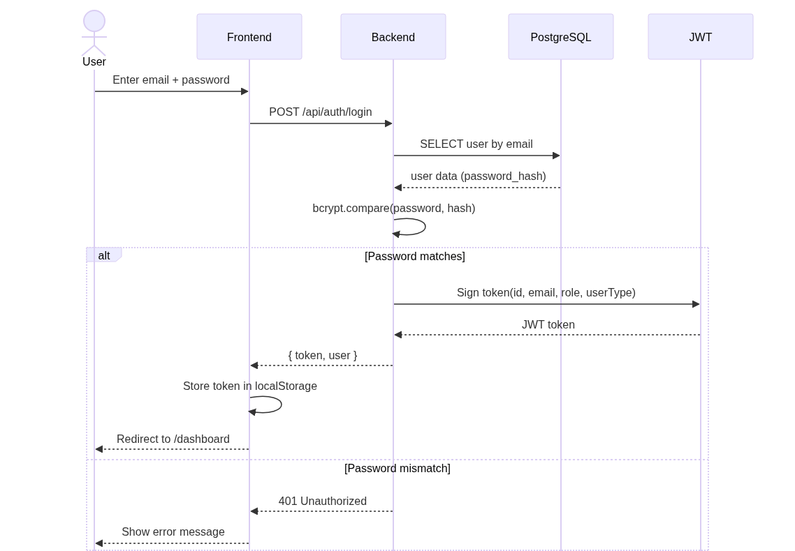
**Figure 3.5: Authentication sequence**
**Figure 3.5: Authentication sequence**

**Submitting a Survey Response**

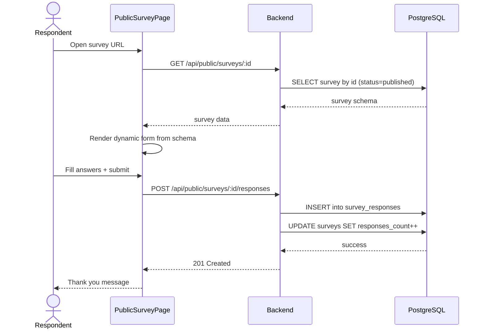
```mermaid
sequenceDiagram
    actor Respondent
    participant Frontend as PublicSurveyPage
    participant Backend
    participant DB as PostgreSQL

    Respondent->>Frontend: Open survey URL
    Frontend->>Backend: GET /api/public/surveys/:id
    Backend->>DB: SELECT survey by id (status=published)
    DB-->>Backend: survey schema
    Backend-->>Frontend: survey data
    Frontend->>Frontend: Render dynamic form from schema
    Respondent->>Frontend: Fill answers + submit
    Frontend->>Backend: POST /api/public/surveys/:id/responses
    Backend->>DB: INSERT into survey_responses
    Backend->>DB: UPDATE surveys SET responses_count++
    DB-->>Backend: success
    Backend-->>Frontend: 201 Created
    Frontend-->>Respondent: Thank you message
```


> **Description:** The survey response sequence shows the public respondent flow: opening the survey URL, dynamic form rendering from the JSON schema, answer submission, database insertion with response counting, and thank-you confirmation.

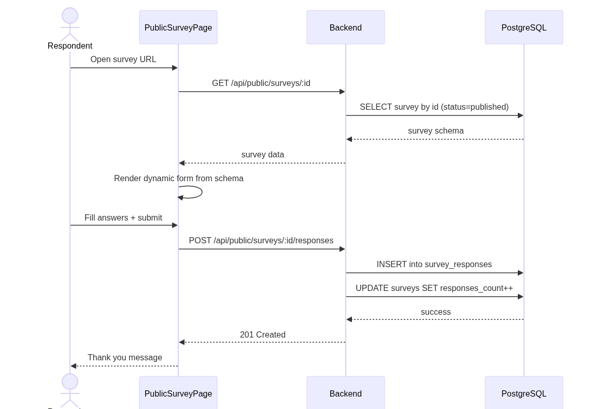
**Figure 3.6: Survey response sequence**
**Figure 3.6: Survey response sequence**

**Generating an AI Report**

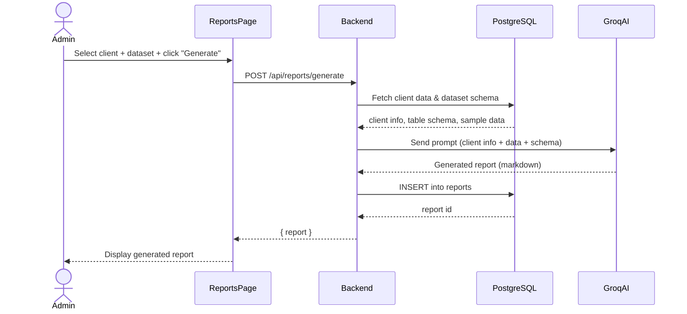
```mermaid
sequenceDiagram
    actor Admin
    participant Frontend as ReportsPage
    participant Backend
    participant DB as PostgreSQL
    participant GroqAI

    Admin->>Frontend: Select client + dataset + click "Generate"
    Frontend->>Backend: POST /api/reports/generate
    Backend->>DB: Fetch client data & dataset schema
    DB-->>Backend: client info, table schema, sample data
    Backend->>GroqAI: Send prompt (client info + data + schema)
    GroqAI-->>Backend: Generated report (markdown)
    Backend->>DB: INSERT into reports
    DB-->>Backend: report id
    Backend-->>Frontend: { report }
    Frontend-->>Admin: Display generated report
```


> **Description:** The AI report sequence illustrates the two-stage pipeline: client and dataset data fetching, Groq AI prompt construction with schema context, markdown report generation, and persistent storage in the reports table.

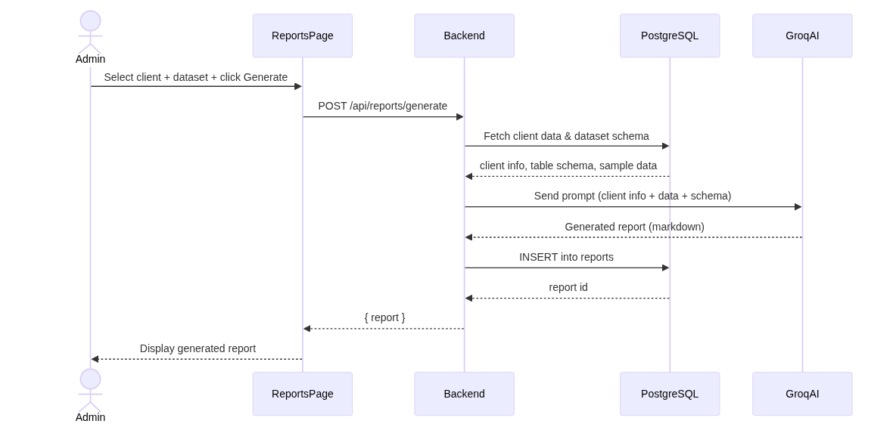
**Figure 3.7: AI report sequence**
**Figure 3.7: AI report sequence**

#### 3.4.4 Activity Diagram

**Survey Creation Flow**

```mermaid
flowchart TD
    Start([Start]) --> A[Navigate to Surveys page]
    A --> B[Click "Create Survey"]
    B --> C{Choose method}
    C -->|AI Generate| D[Enter goal description]
    C -->|Manual| E[Build fields manually]
    D --> F[Send goal to Groq AI]
    F --> G[Receive structured survey JSON]
    G --> H[Edit/modify fields]
    E --> H
    H --> I[Save as draft]
    I --> J{Ready to publish?}
    J -->|No| K[Keep editing]
    K --> H
    J -->|Yes| L[Publish survey]
    L --> M[Set public URL + QR code]
    M --> N[Distribute to respondents]
    N --> O[Collect responses]
    O --> P[View results]
    P --> End([End])
```


> **Description:** The survey creation activity diagram shows the dual-path workflow (AI generation from goal description versus manual field building), draft saving, publishing, QR code distribution, and response collection.

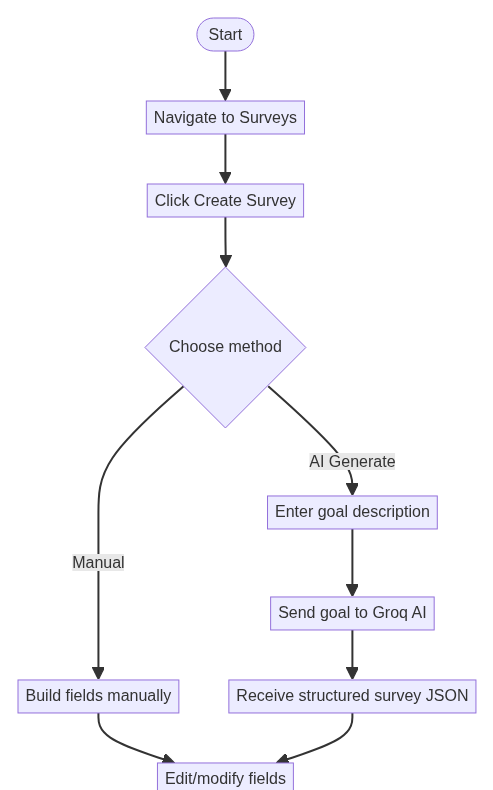
**Figure 3.8: Survey creation activity**
**Figure 3.8: Survey creation activity**
#### 3.4.5 Supplementary Diagrams

**Figure 3.9: Data Import Flow**

> **Description:** The data import flow diagram details the complete schema-agnostic pipeline from file upload through parsing, type inference, column mapping, table creation, bulk insertion, and error handling with per-row status reporting.

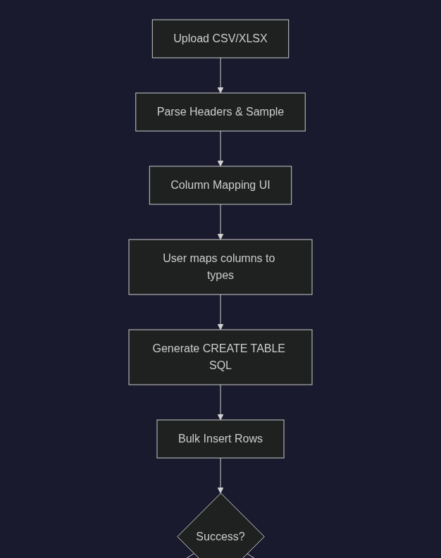
**Figure 3.9: Data Import Flow**

**Figure 3.10: RBAC Architecture**

> **Description:** The RBAC architecture diagram shows the dual authentication paths (staff via email, clients via username), the JWT middleware verification layer, the permission-checking gate, and the role-permission matrix stored in the database.

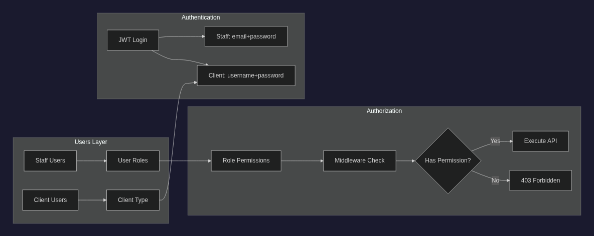
**Figure 3.10: RBAC Architecture**

**Figure 3.11: Deployment Architecture**

> **Description:** The deployment diagram illustrates the Docker Compose local development setup with three containers (frontend, backend, PostgreSQL), the Railway production deployment, and the external Groq AI API integration via Axios.

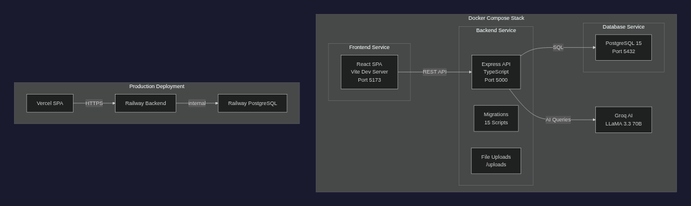
**Figure 3.11: Deployment Architecture**

**Figure 3.12: Component Interaction**

> **Description:** The component interaction diagram shows the React frontend's context-based state management (AuthContext, ThemeContext, NotificationContext), the Axios HTTP layer with JWT interceptor, and the backend's layered controller-service-database architecture.

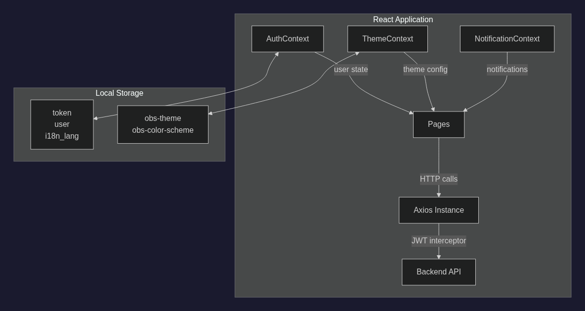
**Figure 3.12: Component Interaction**

**Figure 3.13: Survey Response Flow**

> **Description:** The survey response flow covers the complete lifecycle: admin creates and publishes a survey, generates a public URL with QR code, the respondent opens the dynamic form, submits answers, and the response is stored with duplicate prevention for authenticated clients.

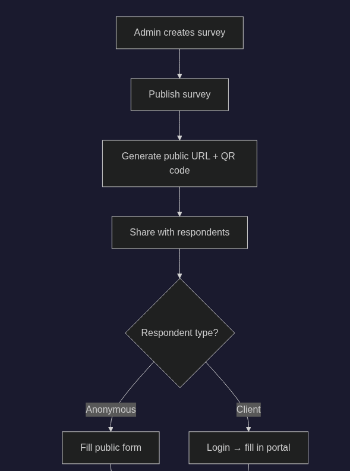
**Figure 3.13: Survey Response Flow**

**Figure 3.14: Chart Builder Workflow**

> **Description:** The chart builder workflow shows the step-by-step visualisation process: dataset selection, column and aggregation configuration, chart type choice, appearance customisation, real-time preview rendering, and saving to the chart library for dashboard use.

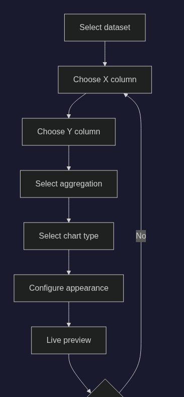
**Figure 3.14: Chart Builder Workflow**

**Figure 3.15: Dashboard Publishing Flow**

> **Description:** The dashboard publishing flow demonstrates how saved charts are added to a dashboard canvas, arranged in a drag-and-drop grid layout, saved with a JSON layout configuration, and optionally published for anonymous public access.

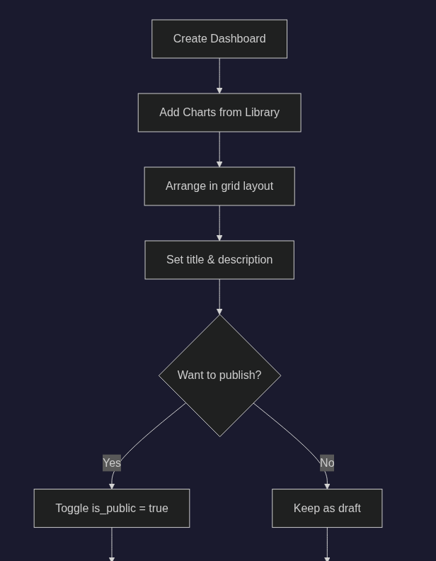
**Figure 3.15: Dashboard Publishing Flow**


---

## Chapter 4: Implementation

### 4.1 Development Workflow (Agile with GitHub Milestones)

The project was developed using an Agile methodology with 13 development phases, each treated as a GitHub milestone with associated issues. The branches followed a feature-branch workflow:

- `main` — Production branch (auto-deploys to Railway + Vercel)
- `dev` — Development integration branch
- `feature/*` — Individual feature branches merged into `dev` via pull requests

**Table 4.1: Development phases and milestones**

| Phase | Name | Key Deliverables | Duration |
|-------|------|------------------|----------|
| 1 | Foundation & Core Fixes | Ant Design migration, Docker setup, build fixes | Week 1-2 |
| 2 | UI/UX Overhaul | Theme system, responsive layout, sidebar redesign | Week 3-4 |
| 3 | Chart & Data Power-Up | 10 chart types, aggregation, dashboard canvas | Week 5-6 |
| 4 | Relational Data & AI Automation | Foreign keys, ER diagram, saved queries | Week 7-8 |
| 5 | New Features | Notifications, data export, schema editor, surveys | Week 9-10 |
| 6 | Documentation | PROGRESS.md, architecture diagrams, API docs | Week 11 |
| 7 | Bug Fixes & Security | RBAC fixes, role protections, crash fixes | Week 11-12 |
| 8 | Client System & AI Reports | Clients CRUD, AI reports, public portal | Week 13-14 |
| 9 | Polish | Error handling, accessibility, Popconfirm wrappers | Week 15 |
| 10 | Further Polish | Form validation, keyboard handlers, Empty states | Week 15-16 |
| 11 | i18n Integration | French/English translations, 830+ keys | Week 17-18 |
| 12 | i18n Fixes & Final Polish | Namespace fixes, remaining hardcoded strings | Week 18-19 |
| 13 | Blank Screen Fix & AI i18n | ErrorBoundary, boot error detection, AI page i18n | Week 19-20 |

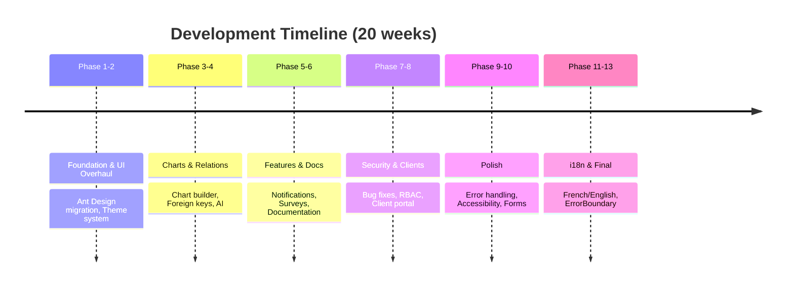
```mermaid
timeline
    title Development Timeline (20 weeks)
    Phase 1-2 : Foundation & UI Overhaul : Ant Design migration, Theme system
    Phase 3-4 : Charts & Relations : Chart builder, Foreign keys, AI
    Phase 5-6 : Features & Docs : Notifications, Surveys, Documentation
    Phase 7-8 : Security & Clients : Bug fixes, RBAC, Client portal
    Phase 9-10 : Polish : Error handling, Accessibility, Forms
    Phase 11-13 : i18n & Final : French/English, ErrorBoundary
```


> **Description:** The development timeline shows the 20-week Agile process across 13 phases, from Ant Design migration and theme system foundation through to i18n integration, blank-screen fixes, and final polish.

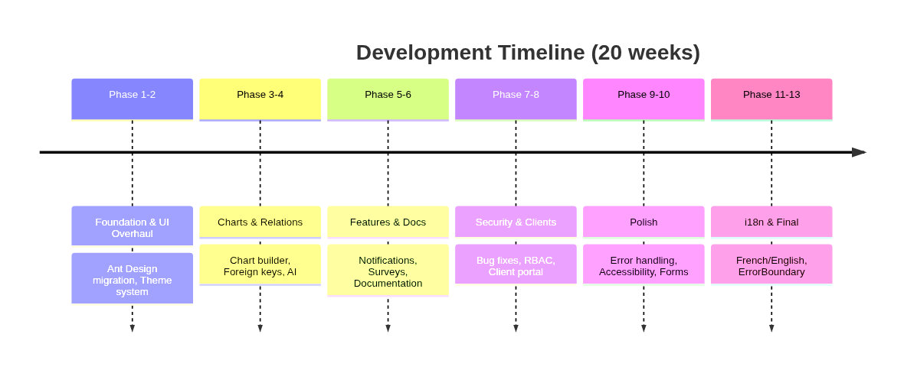
**Figure 4.1: Development timeline**
**Figure 4.1: Development timeline**

### 4.2 Backend Implementation

The backend is built with Express 4 and TypeScript, following a controller-service pattern with middleware for cross-cutting concerns.

#### Key API Endpoints

**Table 4.2: Key API endpoints**

| Method | Path | Auth | Description |
|--------|------|------|-------------|
| POST | /api/auth/login | None | Staff login |
| POST | /api/auth/client-login | None | Client login |
| GET | /api/auth/me | JWT | Current user |
| POST | /api/datasets/upload | JWT | Upload file |
| POST | /api/datasets/:id/import | JWT | Import to table |
| GET | /api/datasets/:id/data | JWT | Query data |
| POST | /api/ai/query | JWT | NL query via Groq |
| GET | /api/ai/history | JWT | Chat history |
| POST | /api/charts | JWT | Create chart |
| POST | /api/dashboards | JWT | Create dashboard |
| GET | /api/public/dashboards | None | Public dashboards |
| GET | /api/public/surveys/:id | None | Public survey |
| POST | /api/clients/bulk-import | JWT | Bulk client import |
| POST | /api/reports/generate | JWT | AI report generation |
| GET | /api/stats | JWT | Dashboard stats |
| GET | /api/health | None | Server health check |

#### Authentication Mechanism

Authentication uses JWT (JSON Web Tokens) with a dual authentication path:

1. **Staff login** (`POST /api/auth/login`): Authenticates against the `users` table using email and password. Returns a JWT containing `{ id, email, role, userType: 'staff' }`.

2. **Client login** (`POST /api/auth/client-login`): Authenticates against the `clients` table using username and password. Returns a JWT containing `{ id, username, role, userType: 'client' }`.

The JWT is signed with a configurable secret and has a default expiry of 24 hours. The frontend attaches the token to all requests via an Axios interceptor. On 401 responses, the interceptor clears the token and redirects to the login page.

#### Password Handling

All passwords are hashed using bcryptjs with 10 salt rounds. The `clients` table uses CIN (National ID Number) as the default password for bulk-imported users, following ISET Tozeur's existing convention. Staff passwords are set during creation by admins.

#### CSV Import Logic

The import pipeline works in four stages:

1. **Upload**: File is received via multer and saved to the `uploads/` directory. A record is created in the `datasets` table with status `uploaded`.

2. **Preview**: The file is parsed using papaparse (CSV) or exceljs (XLSX). Headers are extracted along with sample rows. The frontend displays these in a column-mapping workspace.

3. **Mapping**: The user maps each file header to an SQL column name and data type (TEXT, INTEGER, NUMERIC, DATE, BOOLEAN). The frontend auto-detects types based on sample data.

4. **Import**: The `tableBuilder` service generates a `CREATE TABLE` statement and bulk-inserts rows using parameterised queries. Type coercion is applied per column. The dataset status is updated to `imported`.

#### Indicator Calculation

The AI service uses a two-stage pipeline:

1. **NL-to-SQL**: The user's question is combined with the database schema (table names, column names, types) into a prompt sent to Groq AI (LLaMA 3.3 70B). The AI returns a safe SELECT query. Server-side validation rejects any non-SELECT statements.

2. **Results-to-Insights**: The query results are sent to Groq AI in a second call, producing 2-4 sentences of natural-language interpretation with bold key figures. This is displayed alongside the raw results.

#### Code Organisation

```
backend/src/
├── config/
│   ├── index.ts           # Environment config
│   ├── database.ts        # PostgreSQL pool
│   └── migrations.ts      # 15 programmatic migrations
├── controllers/
│   ├── auth.controller.ts       # Login, client login, profile
│   ├── datasets.controller.ts   # Upload, preview, import
│   ├── ai.controller.ts         # NL query, history
│   ├── charts.controller.ts     # Chart CRUD + data
│   ├── dashboards.controller.ts # Dashboard CRUD
│   ├── clients.controller.ts    # Client CRUD + bulk import
│   ├── reports.controller.ts    # Report CRUD + AI generate
│   ├── users.controller.ts      # User CRUD
│   ├── roles.controller.ts      # Role CRUD
│   ├── foreignKeys.controller.ts
│   ├── savedQueries.controller.ts
│   ├── notifications.controller.ts
│   ├── dataProfile.controller.ts
│   └── datasets.controller.ts
├── middleware/
│   ├── auth.ts             # JWT verification, RBAC
│   ├── errorHandler.ts     # Global error handler
│   └── upload.ts           # Multer configuration
├── routes/                 # Express routers (17 files)
├── services/
│   ├── ai.ts               # Groq API client
│   ├── parser.ts           # CSV/Excel parsing
│   └── tableBuilder.ts     # Dynamic SQL generation
└── server.ts               # Entry point
```

### 4.3 Frontend Implementation

The frontend is built with React 19, TypeScript, Vite 7, and Ant Design 6. It follows a component-based architecture with contexts for global state management.

#### Main Pages/Components

| Route | Component | Description |
|-------|-----------|-------------|
| `/` | LandingPage | Public marketing page with features, stats, testimonials |
| `/login` | LoginPage | Split-screen login with staff/client toggle |
| `/dashboard` | DashboardPage | Admin dashboard with KPIs, quick actions, AI insights |
| `/import` | DataImportPage | File upload, column mapping, import status |
| `/explore` | DatabaseExplorerPage | Card grid of dynamic tables |
| `/explore/:id` | TableEditorPage | Row CRUD, schema editor, data profile |
| `/ai` | AIAnalysisPage | Chat interface with NL query, inline charts |
| `/charts` | ChartBuilderPage | Chart creation with live preview |
| `/dashboards` | DashboardCanvasPage | Drag-and-drop dashboard editor |
| `/surveys` | SurveyGeneratorPage | AI/manual survey creation, publishing |
| `/users` | UsersPage | Staff user management (admin only) |
| `/roles` | RolesPage | Role/permission management (admin only) |
| `/clients` | ClientsPage | Client CRUD, bulk import (admin/teacher) |
| `/reports` | ReportsPage | AI report generation and management |
| `/portal` | ClientDashboardPage | Student/alumni self-service portal |
| `/public` | PublicDashboardPage | Anonymous published dashboards |
| `/public/surveys/:id` | PublicSurveyPage | Anonymous survey response |
| `/settings` | SettingsPage | Theme, language, profile settings |
| `/docs` | DocsPage | API documentation, quick start guide |
| `/queries` | SavedQueriesPage | Save and execute custom SQL |

#### State Management

The application uses React Context for global state management:

- **AuthContext**: Manages authentication state (user, token, login/logout). Stores token and user data in localStorage for persistence across page refreshes.
- **ThemeContext**: Manages light/dark mode and 5 color schemes (ocean, forest, sunset, lavender, crimson). Persists preferences to localStorage.
- **NotificationContext**: Manages in-app notifications with auto-refresh every 60 seconds.

#### Responsive Design

The application is fully responsive using Ant Design's Grid system (`Row`, `Col` with `xs`/`sm`/`md`/`lg`/`xl` breakpoints). Key responsive features:

- Sidebar collapses automatically on mobile screens (< 992px).
- Tables switch to card views on small screens.
- Modals use a `useModalWidth` hook that returns different widths based on screen size.
- Header bar shows a hamburger menu button on mobile when the sidebar is collapsed.

#### Communication with Backend

All API communication is handled through a shared Axios instance configured in `frontend/src/lib/api.ts`:

- Base URL is configured via the `VITE_API_URL` environment variable.
- JWT token is automatically attached to every request via a request interceptor.
- 401 responses trigger automatic logout and redirect to `/login`.
- Error responses are handled globally with user-friendly messages via Ant Design's `message` API.

### 4.4 Database Schema

The database uses PostgreSQL 15 with schema managed through programmatic migrations. Below is a simplified DDL:

```sql
-- Core tables
CREATE TABLE users (
    id SERIAL PRIMARY KEY,
    email VARCHAR(255) UNIQUE NOT NULL,
    password_hash VARCHAR(255) NOT NULL,
    full_name VARCHAR(255) NOT NULL,
    role VARCHAR(50) DEFAULT 'viewer',
    is_active BOOLEAN DEFAULT true,
    preferences JSONB DEFAULT '{}',
    user_type VARCHAR(50) DEFAULT 'staff',
    created_at TIMESTAMPTZ DEFAULT NOW(),
    updated_at TIMESTAMPTZ DEFAULT NOW()
);

CREATE TABLE roles (
    id SERIAL PRIMARY KEY,
    name VARCHAR(100) UNIQUE NOT NULL,
    description TEXT,
    is_system BOOLEAN DEFAULT false,
    created_at TIMESTAMPTZ DEFAULT NOW()
);

CREATE TABLE permissions (
    id SERIAL PRIMARY KEY,
    name VARCHAR(100) UNIQUE NOT NULL,
    description TEXT,
    category VARCHAR(50) DEFAULT 'general'
);

CREATE TABLE role_permissions (
    role_id INT REFERENCES roles(id) ON DELETE CASCADE,
    permission_id INT REFERENCES permissions(id) ON DELETE CASCADE,
    PRIMARY KEY (role_id, permission_id)
);

CREATE TABLE user_roles (
    user_id INT REFERENCES users(id) ON DELETE CASCADE,
    role_id INT REFERENCES roles(id) ON DELETE CASCADE,
    PRIMARY KEY (user_id, role_id)
);

CREATE TABLE datasets (
    id SERIAL PRIMARY KEY,
    name VARCHAR(255) NOT NULL,
    file_name VARCHAR(255) NOT NULL,
    table_name VARCHAR(255) UNIQUE,
    status VARCHAR(50) DEFAULT 'uploaded',
    row_count INT DEFAULT 0,
    column_mapping JSONB,
    uploaded_by INT REFERENCES users(id),
    created_at TIMESTAMPTZ DEFAULT NOW(),
    updated_at TIMESTAMPTZ DEFAULT NOW()
);

CREATE TABLE charts (
    id SERIAL PRIMARY KEY,
    title VARCHAR(255) NOT NULL,
    chart_type VARCHAR(50) NOT NULL,
    dataset_id INT REFERENCES datasets(id) ON DELETE CASCADE,
    config JSONB DEFAULT '{}',
    created_by INT REFERENCES users(id),
    created_at TIMESTAMPTZ DEFAULT NOW(),
    updated_at TIMESTAMPTZ DEFAULT NOW()
);

CREATE TABLE dashboards (
    id SERIAL PRIMARY KEY,
    title VARCHAR(255) NOT NULL,
    description TEXT,
    layout JSONB DEFAULT '[]',
    is_public BOOLEAN DEFAULT false,
    created_by INT REFERENCES users(id),
    created_at TIMESTAMPTZ DEFAULT NOW(),
    updated_at TIMESTAMPTZ DEFAULT NOW()
);

CREATE TABLE clients (
    id SERIAL PRIMARY KEY,
    cin VARCHAR(50) UNIQUE NOT NULL,
    username VARCHAR(100) UNIQUE NOT NULL,
    full_name VARCHAR(255) NOT NULL,
    email VARCHAR(255),
    phone VARCHAR(50),
    client_type VARCHAR(50) DEFAULT 'student',
    is_active BOOLEAN DEFAULT true,
    password_hash VARCHAR(255) NOT NULL,
    created_by INT REFERENCES users(id),
    created_at TIMESTAMPTZ DEFAULT NOW(),
    updated_at TIMESTAMPTZ DEFAULT NOW()
);

CREATE TABLE reports (
    id SERIAL PRIMARY KEY,
    title VARCHAR(255) NOT NULL,
    content TEXT NOT NULL,
    report_type VARCHAR(50) DEFAULT 'performance',
    client_id INT REFERENCES clients(id) ON DELETE SET NULL,
    dataset_id INT REFERENCES datasets(id) ON DELETE SET NULL,
    is_public BOOLEAN DEFAULT false,
    created_by INT REFERENCES users(id),
    created_at TIMESTAMPTZ DEFAULT NOW(),
    updated_at TIMESTAMPTZ DEFAULT NOW()
);

CREATE TABLE surveys (
    id SERIAL PRIMARY KEY,
    user_id INT REFERENCES users(id) ON DELETE SET NULL,
    title VARCHAR(255) NOT NULL,
    description TEXT,
    goal TEXT,
    schema JSONB DEFAULT '{}',
    is_public BOOLEAN DEFAULT false,
    status VARCHAR(20) DEFAULT 'draft',
    client_types JSONB DEFAULT '[]',
    responses_count INT DEFAULT 0,
    published_at TIMESTAMPTZ,
    created_at TIMESTAMPTZ DEFAULT NOW(),
    updated_at TIMESTAMPTZ DEFAULT NOW()
);

CREATE TABLE survey_responses (
    id SERIAL PRIMARY KEY,
    survey_id INT NOT NULL REFERENCES surveys(id) ON DELETE CASCADE,
    client_id INT REFERENCES clients(id) ON DELETE SET NULL,
    respondent_type VARCHAR(20),
    answers JSONB DEFAULT '{}',
    submitted_at TIMESTAMPTZ DEFAULT NOW()
);
```

### 4.5 Screenshot Placeholders


> **Description:** The landing page introduces the Digital Observatory with the ISET branding banner, feature highlight cards, real-time usage statistics, and a footer listing technology partners.

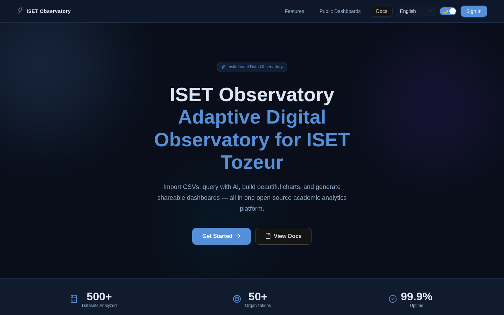
**Figure 4.2: Landing page**
**Figure 4.2: Landing page**


> **Description:** The login page offers a split-screen design with the ISET logo on the left, a segmented toggle for Staff (email/password) and Client (username/password) authentication, and a lock icon header.

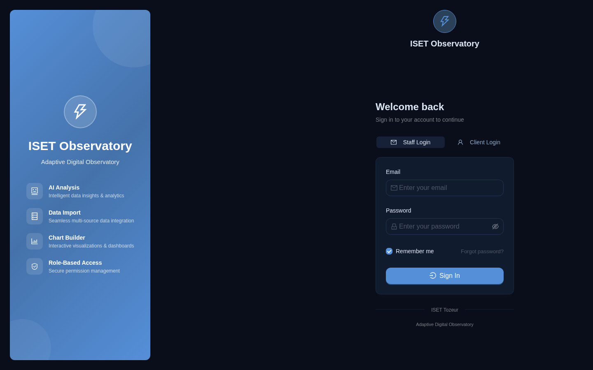
**Figure 4.3: Login page**
**Figure 4.3: Login page**


> **Description:** The administrator dashboard displays four KPI cards (Datasets, Charts, Dashboards, Users), quick action buttons, recent AI analysis insights, and a dataset activity summary table.

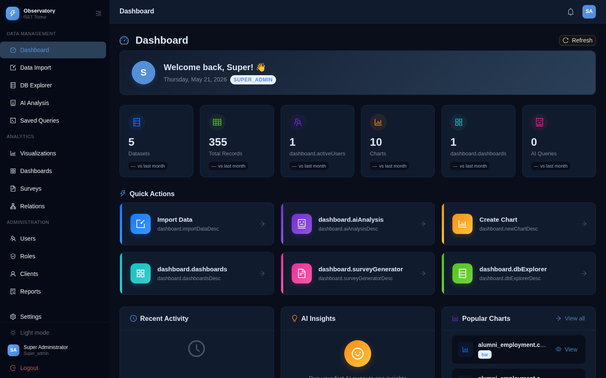
**Figure 4.4: Administrator dashboard**
**Figure 4.4: Administrator dashboard**


> **Description:** The data import page provides a drag-and-drop upload zone supporting CSV and Excel files, with file format validation, size limits, and automatic header detection upon upload.

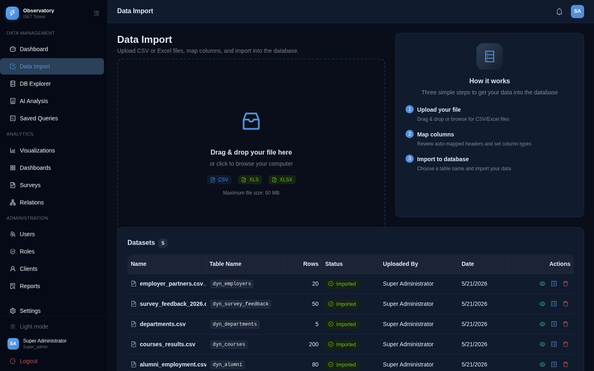
**Figure 4.5: Data import upload**
**Figure 4.5: Data import upload**


> **Description:** The column mapping workspace displays detected headers with auto-inferred SQL types (TEXT, INTEGER, NUMERIC, DATE, BOOLEAN) for each column before import.


**Figure 4.6: Data import column mapping**
**Figure 4.6: Data import column mapping**


> **Description:** The database explorer presents all imported datasets in a card grid, showing each table name, row count, column count, import status, and quick action buttons for viewing or deleting data.

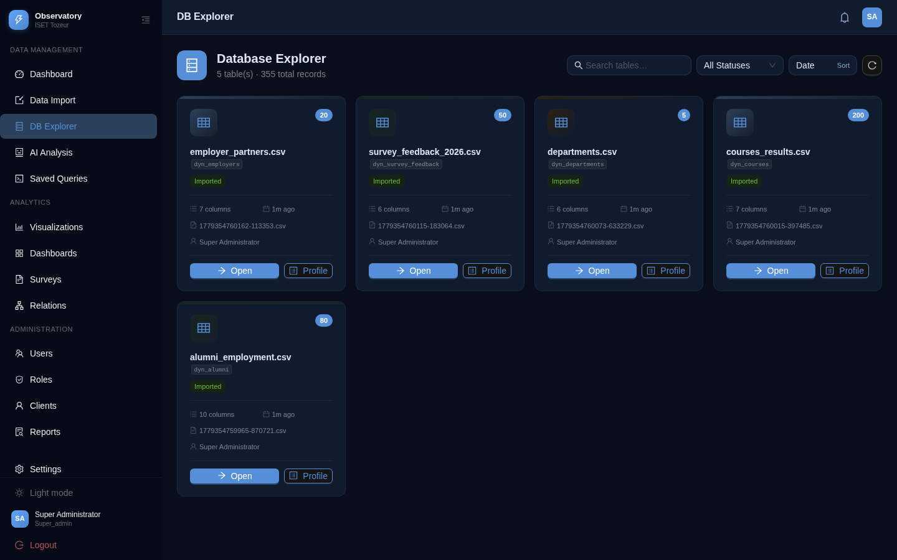
**Figure 4.7: Database explorer**
**Figure 4.7: Database explorer**


> **Description:** The table editor provides paginated data browsing with inline cell editing, column sorting, row insertion/deletion, keyword search across all columns, and schema editing capabilities.

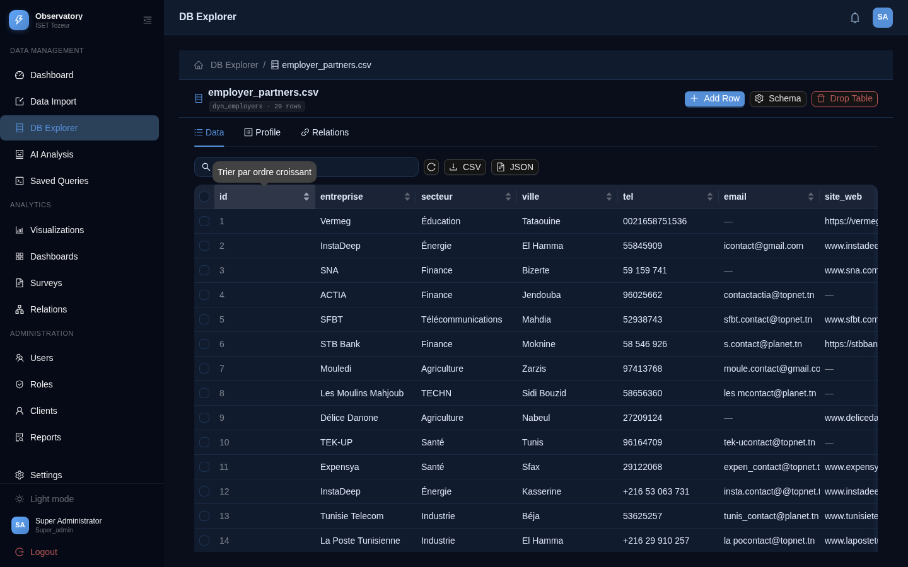
**Figure 4.8: Table editor**
**Figure 4.8: Table editor**


> **Description:** The AI Analysis chat interface allows users to ask natural-language questions about their data, displaying the generated SQL query, formatted results table, and AI-generated insight summary.


**Figure 4.9: AI Analysis chat**
**Figure 4.9: AI Analysis chat**


> **Description:** The AI analysis detail view shows a refined query result with an inline chart visualisation, the generated SQL, and a detailed natural-language interpretation highlighting key metrics.

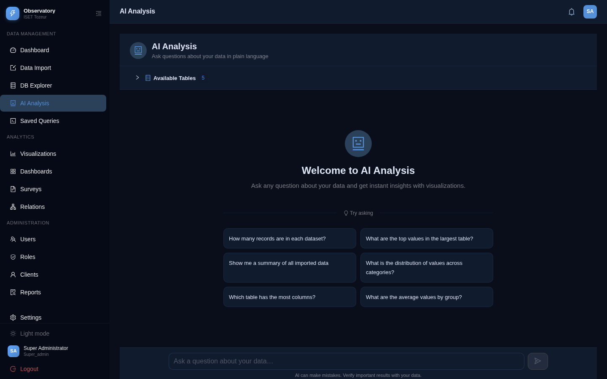
**Figure 4.10: AI Analysis inline chart**
**Figure 4.10: AI Analysis inline chart**


> **Description:** The chart builder features a side-by-side configuration panel and live preview, supporting 10 chart types (bar, line, pie, area, scatter, etc.) with customisable colours, labels, and aggregation functions.


**Figure 4.11: Chart builder**
**Figure 4.11: Chart builder**


> **Description:** The dashboard canvas uses a drag-and-drop grid layout (@dnd-kit) for arranging chart widgets, with resize handles, a chart selector sidebar, and PDF export functionality.


**Figure 4.12: Dashboard canvas**
**Figure 4.12: Dashboard canvas**


> **Description:** The survey generator offers two creation modes: AI-assisted (describe a goal to auto-generate fields) and manual field builder, with support for text, select, radio, rating, and checkbox question types.

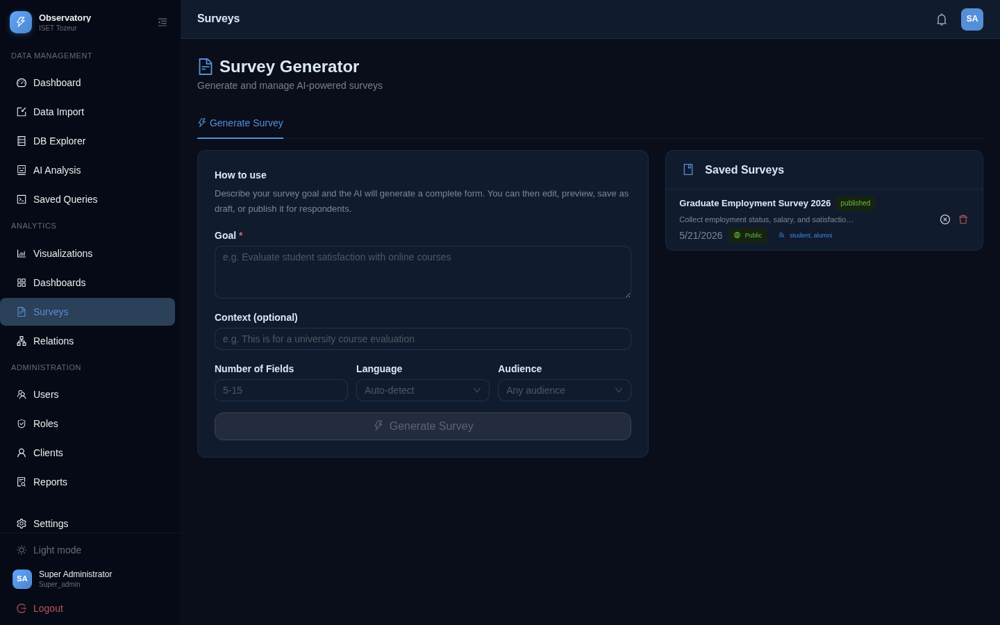
**Figure 4.13: Survey generator**
**Figure 4.13: Survey generator**


> **Description:** The public survey page renders a dynamic form from a JSON schema, collecting anonymous responses with validation, auto-generated QR codes for sharing, and duplicate-response detection.

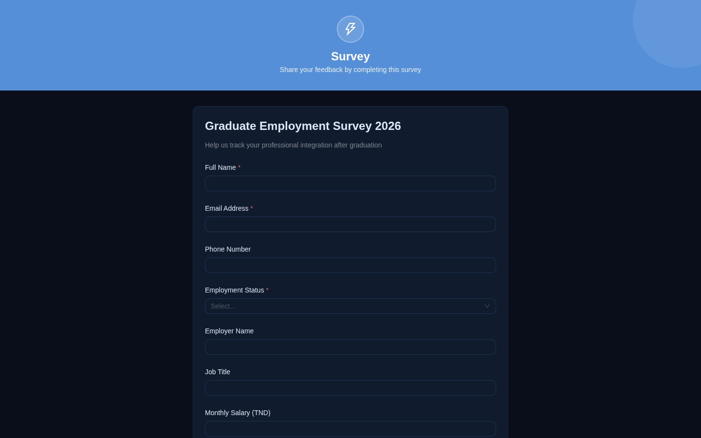
**Figure 4.14: Public survey page**
**Figure 4.14: Public survey page**


> **Description:** The user management interface provides CRUD operations for staff accounts, with search filtering, bulk activate/deactivate toggles, role assignment dropdowns, and self-deletion protection.

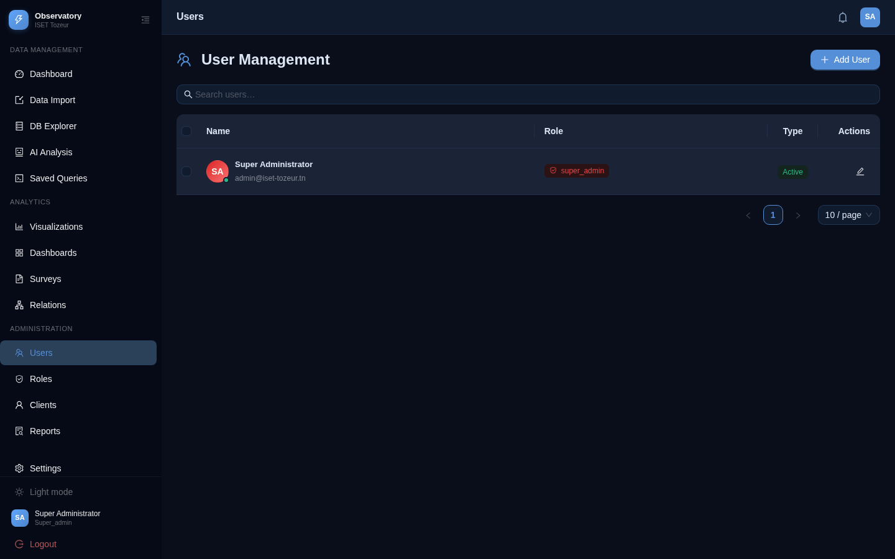
**Figure 4.15: User management**
**Figure 4.15: User management**


> **Description:** The role management page displays a detailed permission matrix with 25+ granular permissions across 6 system roles, plus a side-by-side role comparison tool for visual diffing.

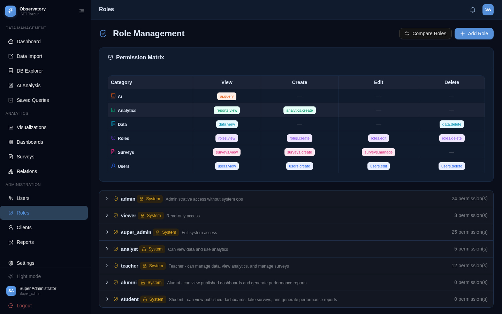
**Figure 4.16: Role management**
**Figure 4.16: Role management**


> **Description:** The client management interface supports full CRUD for student, alumni, and teacher accounts with a three-step CSV bulk import wizard, search, and status filtering.

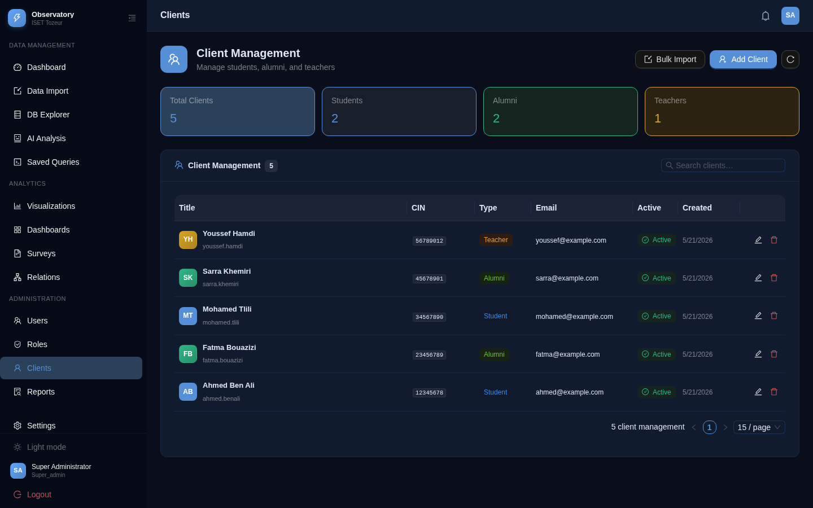
**Figure 4.17: Client management**
**Figure 4.17: Client management**


> **Description:** The reports page lists all AI-generated performance reports with type tags, public/private status indicators, search, and a generation modal for creating new reports from client and dataset selections.


**Figure 4.18: Reports page**
**Figure 4.18: Reports page**


> **Description:** The client portal provides a self-service dashboard for students and alumni with their personal performance reports, published dashboards for public viewing, and account profile information.

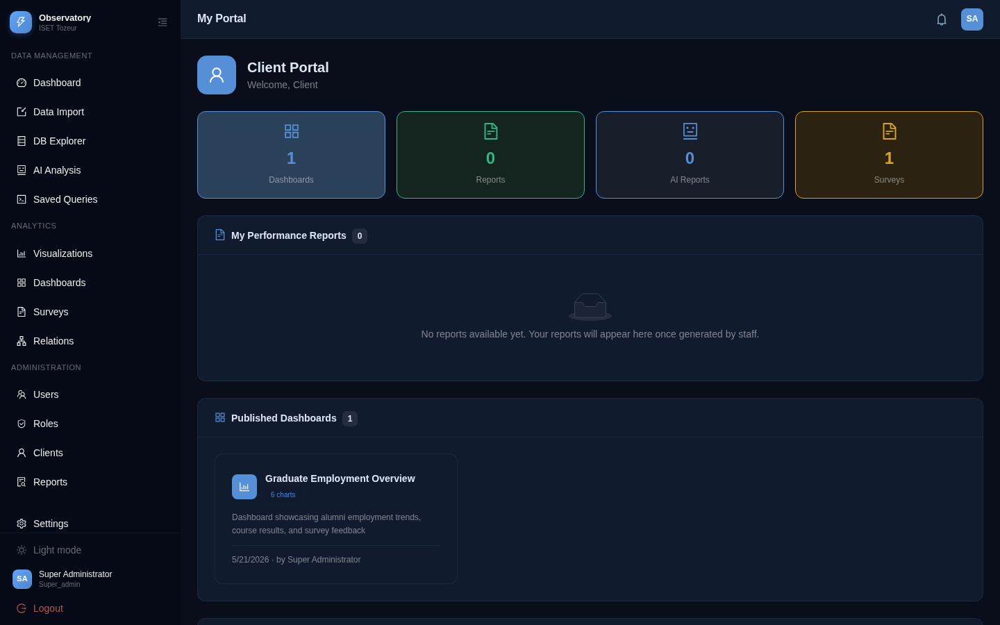
**Figure 4.19: Client portal**
**Figure 4.19: Client portal**


> **Description:** The public dashboard page displays published dashboards accessible without authentication, featuring a gradient header, chart grid layout, and embedded report viewing capabilities.

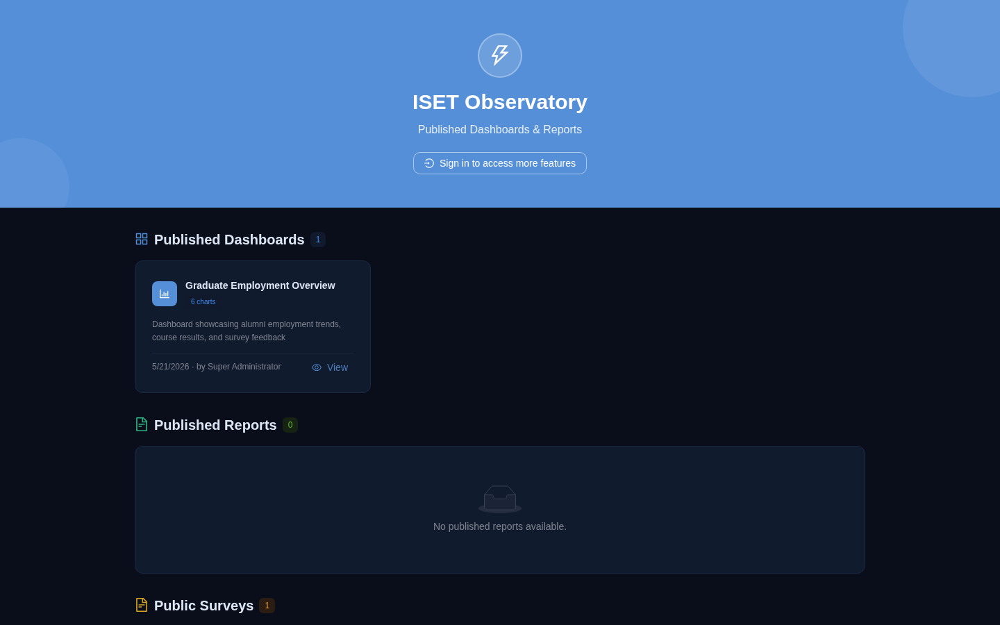
**Figure 4.20: Public dashboard**
**Figure 4.20: Public dashboard**


> **Description:** The settings page centralises profile editing, password changes, theme selection (5 colour schemes), and language toggling for complete French/English internationalisation.

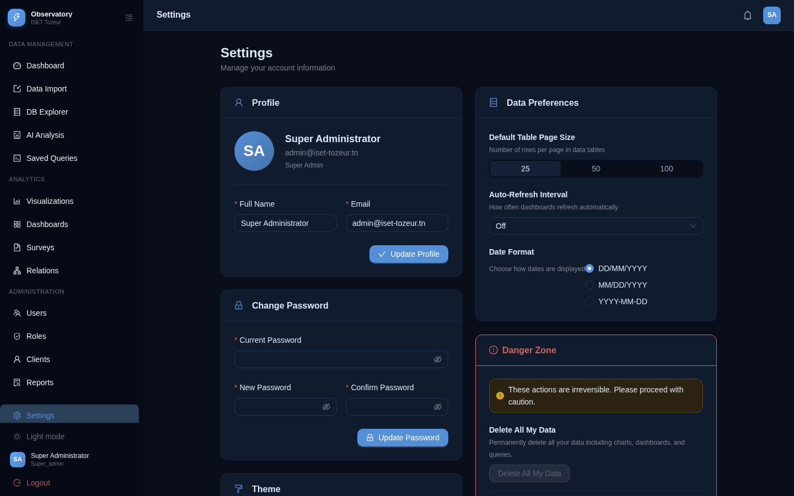
**Figure 4.21: Settings page**
**Figure 4.21: Settings page**


> **Description:** The foreign key manager displays linked tables in an ER diagram visualisation with source-target column relationship lines, AI-suggested foreign key detection, and type compatibility warnings.

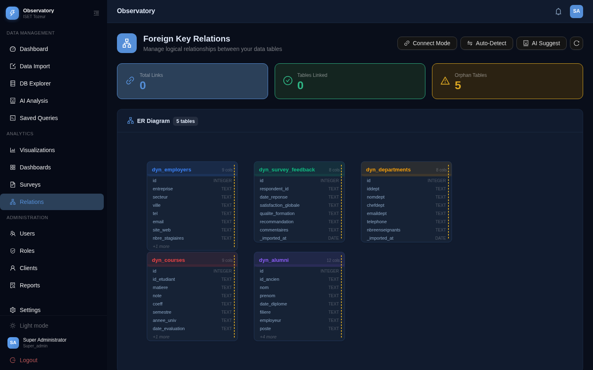
**Figure 4.22: Foreign key manager**
**Figure 4.22: Foreign key manager**


> **Description:** The saved queries page stores custom SQL queries with edit and execute actions, an AI query builder for natural-language-to-SQL conversion, and query history tracking.

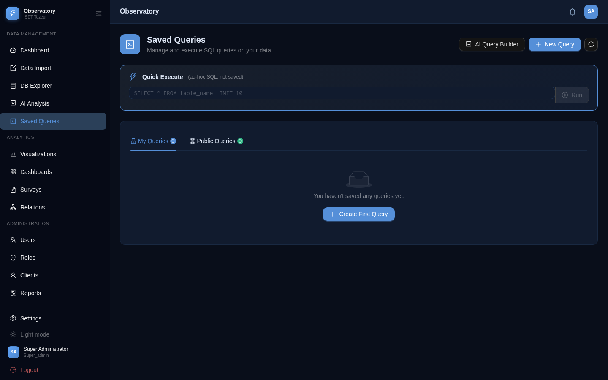
**Figure 4.23: Saved queries**
**Figure 4.23: Saved queries**


> **Description:** The settings theme section provides visual colour swatches for all five colour schemes (Ocean, Forest, Sunset, Lavender, Crimson) with instant live preview on selection.

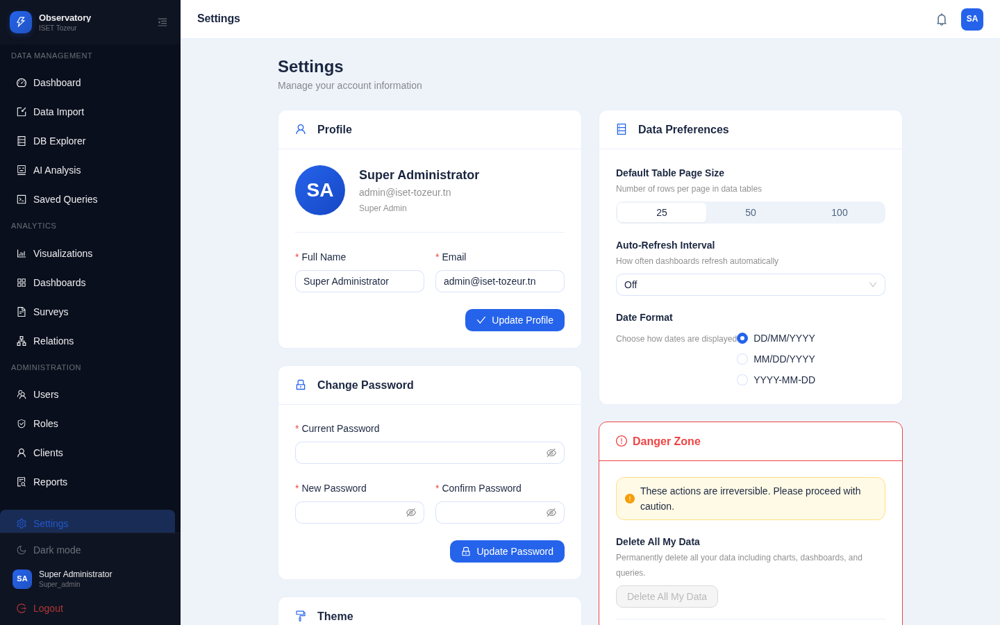
**Figure 4.24: Settings theme system with color scheme selector**
**Figure 4.24: Settings theme system with color scheme selector**


> **Description:** The Forest colour scheme transforms the UI with green-toned accents across the sidebar, header, cards, and buttons, demonstrating the Ant Design token theming engine's capabilities.

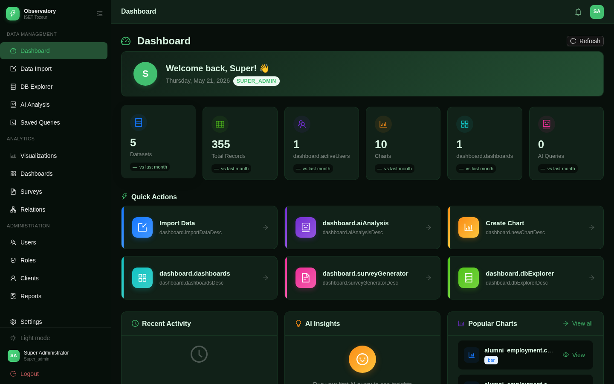
**Figure 4.25: Dashboard in Forest color scheme**
**Figure 4.25: Dashboard in Forest color scheme**


> **Description:** The Sunset colour scheme applies orange-themed styling with coordinated accent colours throughout all UI components in the admin dashboard.

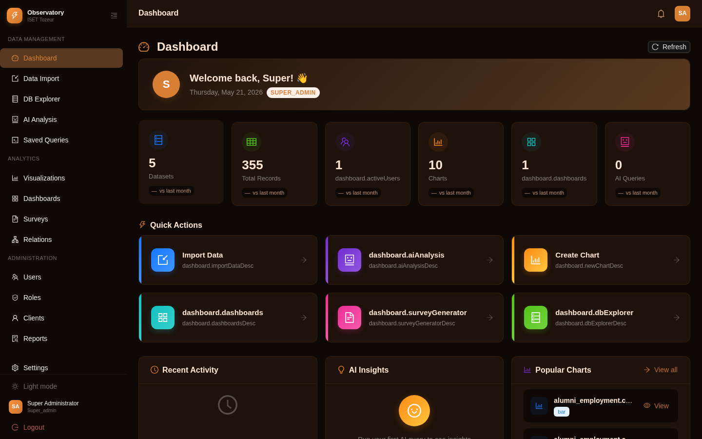
**Figure 4.26: Dashboard in Sunset color scheme**
**Figure 4.26: Dashboard in Sunset color scheme**


> **Description:** The Lavender colour scheme provides a purple-toned visual theme with consistent accent colours across sidebar navigation, headers, and interactive elements.

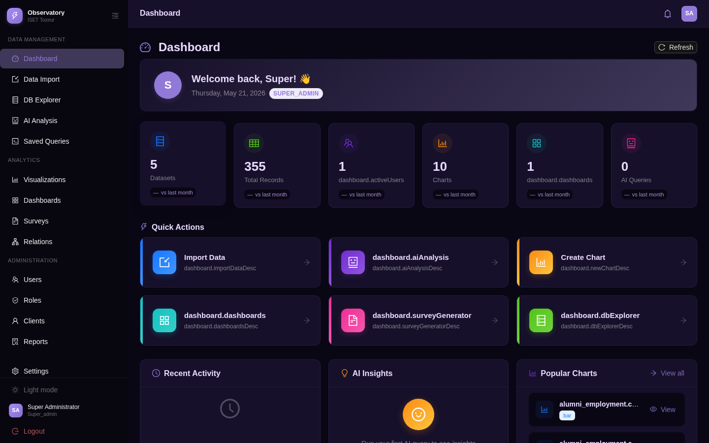
**Figure 4.27: Dashboard in Lavender color scheme**
**Figure 4.27: Dashboard in Lavender color scheme**


> **Description:** The Crimson colour scheme showcases red-themed variant styling, demonstrating how all five colour schemes maintain consistent contrast ratios and readability standards.

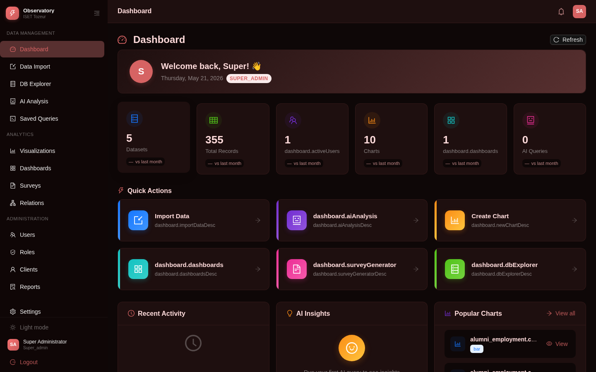
**Figure 4.28: Dashboard in Crimson color scheme**
**Figure 4.28: Dashboard in Crimson color scheme**


> **Description:** The light mode landing page shows the alternative colour mode with white backgrounds, darker text colours, and adapted sidebar styling for optimal daytime readability.

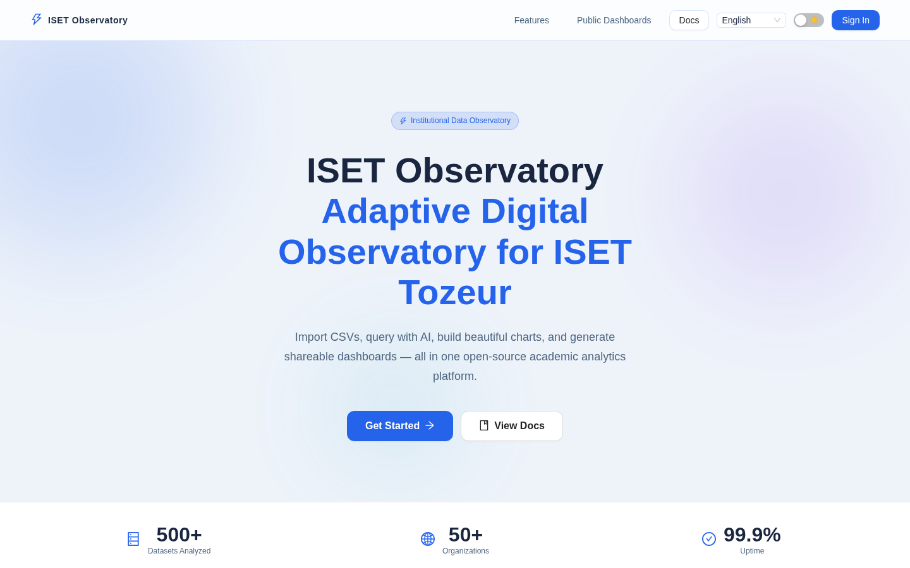
**Figure 4.29: Landing page in light mode**
**Figure 4.29: Landing page in light mode**


> **Description:** The login page with the Client tab selected shows the alternate authentication path using username and CIN-based password, following ISET Tozeur's existing convention.

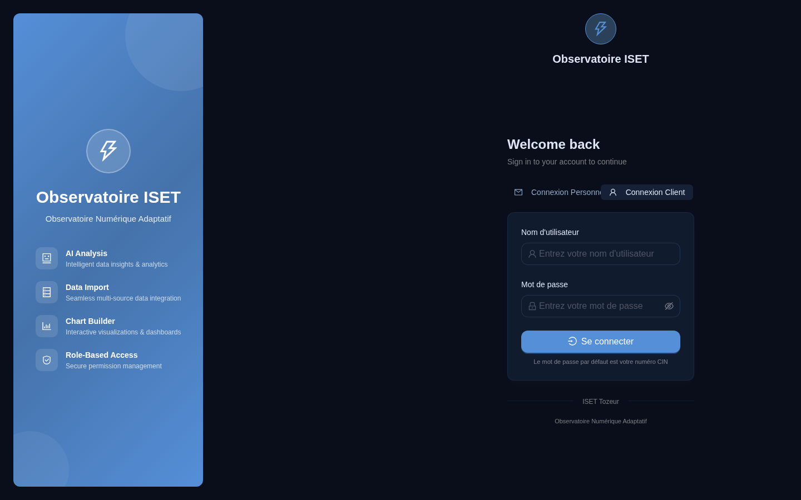
**Figure 4.30: Login page with client toggle**
**Figure 4.30: Login page with client toggle**


> **Description:** The documentation page provides comprehensive API reference with endpoint details, request/response examples, and interactive code samples for all backend routes.

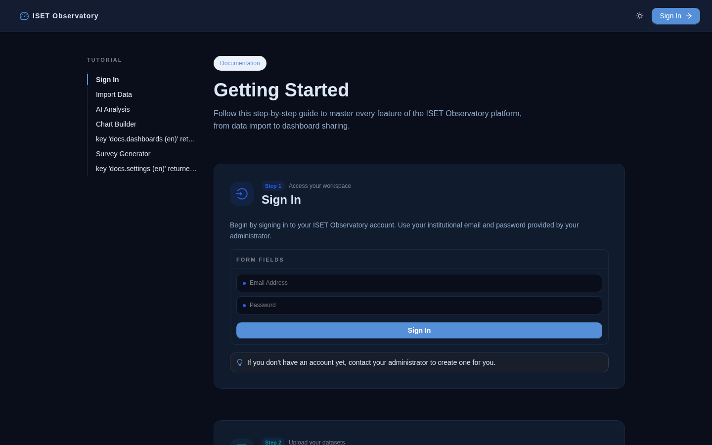
**Figure 4.31: Documentation and API reference page**
**Figure 4.31: Documentation and API reference page**


> **Description:** The survey generator with the manual field editor open shows the drag-and-drop field type selector, JSON schema preview, and field configuration panel for custom survey creation.


**Figure 4.32: Survey generator with field editing capabilities**
**Figure 4.32: Survey generator with field editing capabilities**


> **Description:** The foreign key manager with ER diagram visualisation shows the graphical table relationship viewer, auto-suggested foreign key candidates, and manual key configuration controls.


**Figure 4.33: Foreign key manager with ER diagram visualisation**
**Figure 4.33: Foreign key manager with ER diagram visualisation**


> **Description:** The client management page with extensive data shows the search interface, bulk import wizard step indicator, client type filters, and the inline status management actions.


**Figure 4.34: Client management with search and CRUD capabilities**
**Figure 4.34: Client management with search and CRUD capabilities**


> **Description:** The AI performance reports page with the generation modal open shows the client and dataset selection dropdowns, report type configuration, and the AI generation trigger button.


**Figure 4.35: AI performance reports page with generation modal**
**Figure 4.35: AI performance reports page with generation modal**


#### 4.5.1 French (i18n) Screenshots

> **Description:** The French interface demonstrates the complete internationalisation implementation with over 830 translated keys across all namespaces, including navigation, settings, and landing page content.

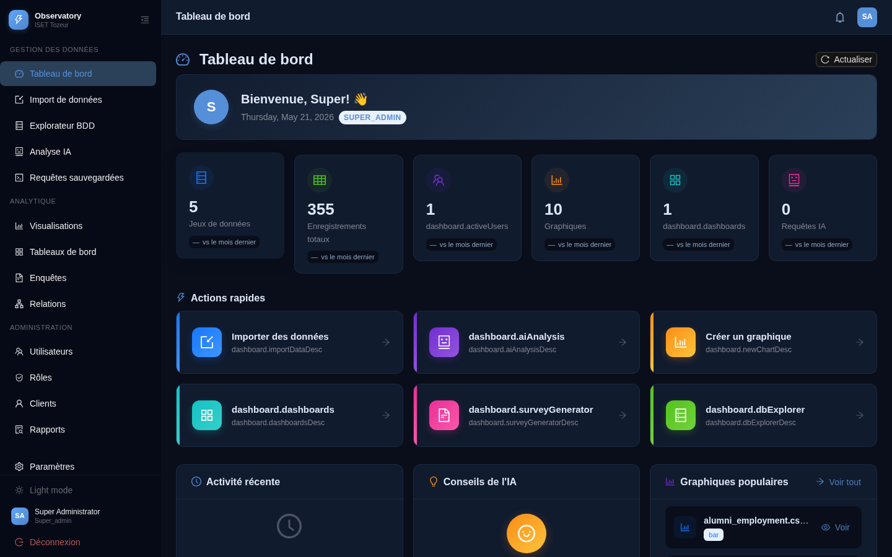
**Figure 4.36: Administrator dashboard in French**
**Figure 4.36: Administrator dashboard in French**

> **Description:** The settings page in French shows the language switcher, theme configuration panel, and profile section with full French translations for all labels and messages.

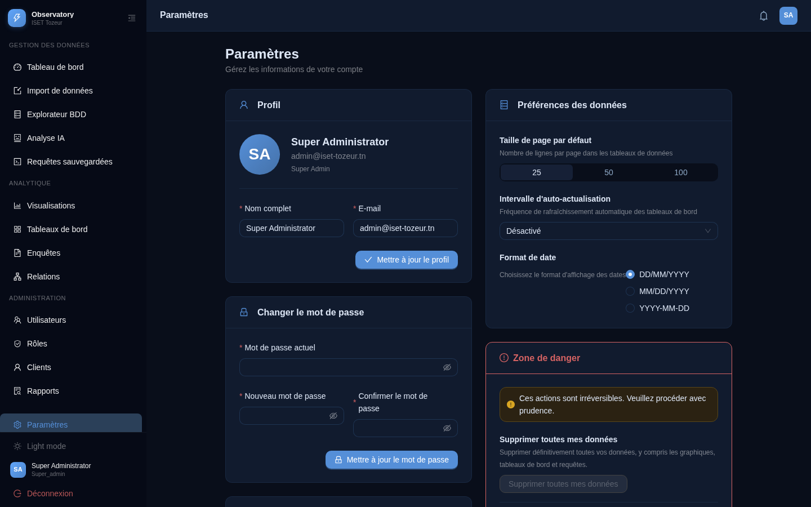
**Figure 4.37: Settings page in French**
**Figure 4.37: Settings page in French**

> **Description:** The landing page in French displays the translated hero section, feature descriptions, and call-to-action buttons, demonstrating the public-facing i18n coverage.

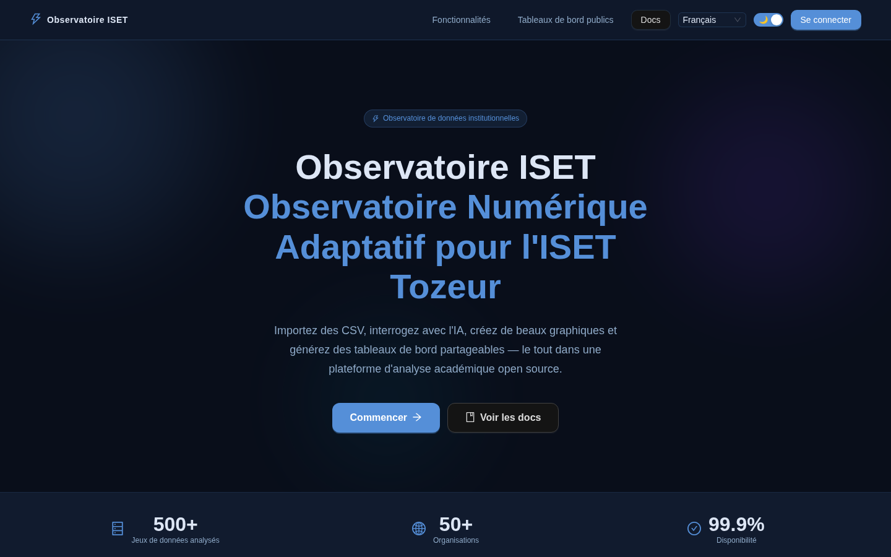
**Figure 4.38: Landing page in French**
**Figure 4.38: Landing page in French**


#### 4.5.2 Additional Screenshots

> **Description:** The authenticated client portal displays the student or alumni user's personalised dashboard with their generated reports, available surveys, and published dashboards after logging in via the Client authentication path.

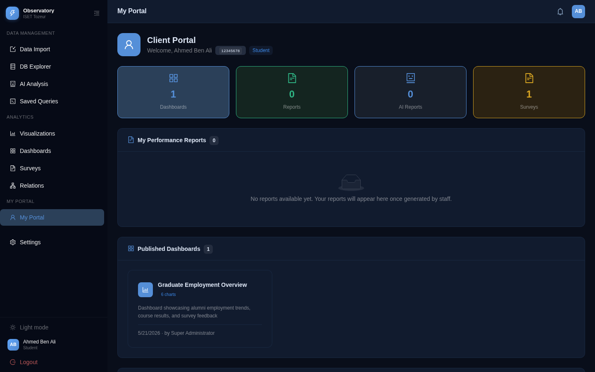
**Figure 4.39: Client portal after authentication**
**Figure 4.39: Client portal after authentication**

> **Description:** The dashboard with populated charts demonstrates live data visualisation with bar, line, and pie charts sourced from imported datasets, showing the integrated charting pipeline from data to visualisation.

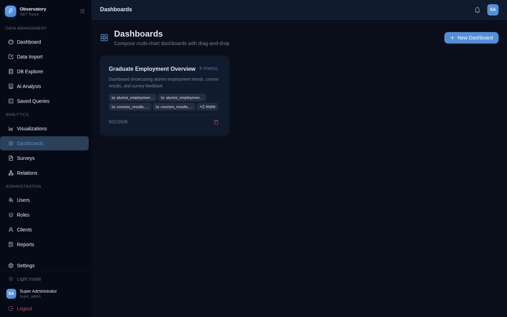
**Figure 4.40: Dashboard populated with charts**
**Figure 4.40: Dashboard populated with charts**

> **Description:** The chart library displays all saved charts with thumbnail previews, supporting duplicate, export to PNG/JSON, and direct addition to dashboards for reusing existing visualisations.

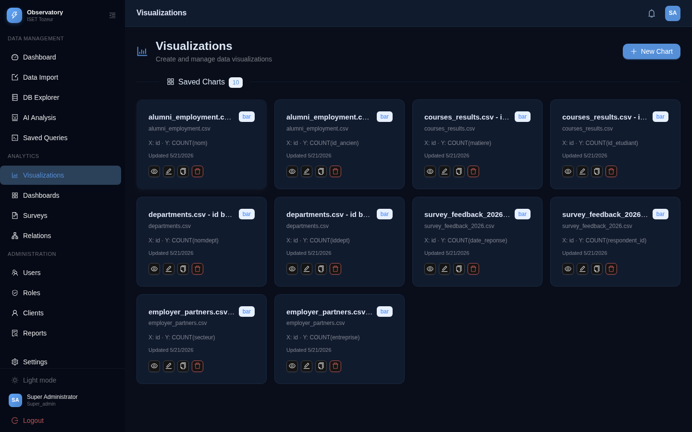
**Figure 4.41: Chart library with saved visualisations**
**Figure 4.41: Chart library with saved visualisations**

> **Description:** The AI-generated performance report view displays structured markdown content with sections including executive summary, key statistical findings, and actionable recommendations for improvement.

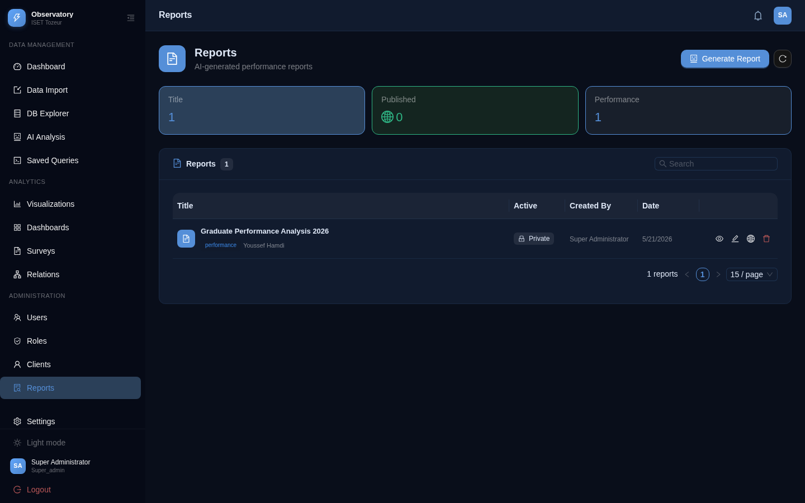
**Figure 4.42: AI-generated performance report**
**Figure 4.42: AI-generated performance report**

> **Description:** The notification system displays in-app alerts with type icons (info, success, warning, error), read/unread indicators, timestamps, and a bell icon in the header with a badge count for unread notifications.

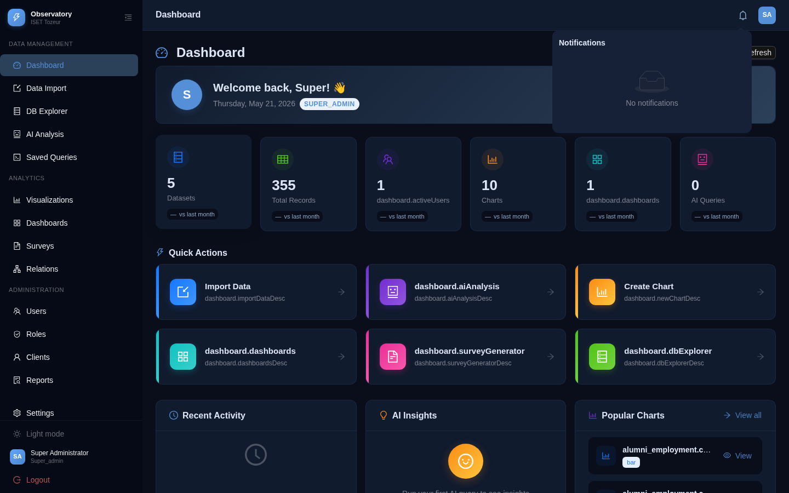
**Figure 4.43: Notification system with in-app alerts**
**Figure 4.43: Notification system with in-app alerts**

---

## Chapter 5: Testing and Validation

### 5.1 Testing Strategy

The testing strategy for this project focused on:

1. **TypeScript compilation** (`tsc --noEmit`): Ensures type safety across the entire codebase. Both frontend and backend pass with zero errors.

2. **Build verification** (`vite build`): Frontend production build passes without warnings or errors.

3. **Runtime error detection**: An ErrorBoundary component catches React render errors and displays a stack trace. A boot-time error detection script in `index.html` captures `window.onerror` and `unhandledrejection` events, displaying a debug panel if the app fails to mount within 8 seconds.

4. **Docker health checks**: Each container includes health checks to verify service availability.

5. **Manual functional testing**: All features were tested manually through the UI, with particular attention to:
   - Authentication flows (staff login, client login, token expiry, logout)
   - Data import (CSV/Excel upload, column mapping, import, preview)
   - AI query (natural language input, SQL generation, result display, insight generation)
   - CRUD operations (create, read, update, delete on all entities)
   - Role-based access (verifying that restricted pages and API endpoints properly block unauthorized users)

6. **End-to-end flow testing**: Critical user journeys were tested end-to-end:
   - Admin uploads data → maps columns → imports → creates chart → adds to dashboard → exports PDF
   - AI query → review results → save chart → add to dashboard
   - Create client → bulk import → client logs in → views portal → generates AI report
   - Create survey → publish → public user submits response → admin views results

### 5.2 Test Cases Summary

**Table 5.1: Test cases summary**

| ID | Feature | Test Case | Expected Result | Status |
|----|---------|-----------|-----------------|--------|
| TC-01 | Authentication | Login with valid staff credentials | Redirect to dashboard | ✅ Pass |
| TC-02 | Authentication | Login with invalid password | Error message "Invalid credentials" | ✅ Pass |
| TC-03 | Authentication | Login with disabled account | Error message "Account is disabled" | ✅ Pass |
| TC-04 | Authentication | Client login with valid credentials | Redirect to /portal | ✅ Pass |
| TC-05 | Authentication | Access protected route without token | Redirect to /login | ✅ Pass |
| TC-06 | Data Import | Upload CSV file | File recorded in datasets table | ✅ Pass |
| TC-07 | Data Import | Preview CSV with auto-detected types | Headers and sample rows displayed | ✅ Pass |
| TC-08 | Data Import | Import with valid mapping | Table created, rows inserted | ✅ Pass |
| TC-09 | Data Import | Import with type coercion errors | Error report with skipped rows | ✅ Pass |
| TC-10 | AI Query | Ask "Show me total students by department" | SQL generated, results displayed | ✅ Pass |
| TC-11 | AI Query | Ask non-SELECT query ("DROP TABLE students") | Blocked by server | ✅ Pass |
| TC-12 | AI Query | View AI chat history | Previous queries displayed | ✅ Pass |
| TC-13 | Charts | Create bar chart with X and Y columns | Chart rendered with preview | ✅ Pass |
| TC-14 | Charts | Export chart as PNG | Image downloaded | ✅ Pass |
| TC-15 | Dashboards | Create dashboard with multiple charts | Charts arranged in grid | ✅ Pass |
| TC-16 | Dashboards | Export dashboard as PDF | PDF with cover page generated | ✅ Pass |
| TC-17 | Dashboards | Publish dashboard | Visible to anonymous users | ✅ Pass |
| TC-18 | RBAC | Admin accesses /users page | Page loads | ✅ Pass |
| TC-19 | RBAC | Viewer accesses /users page | 403 Forbidden page | ✅ Pass |
| TC-20 | RBAC | Super admin cannot delete own account | Delete button hidden | ✅ Pass |
| TC-21 | Clients | Create client with CIN and username | Client added to database | ✅ Pass |
| TC-22 | Clients | Bulk import clients from CSV | Clients created with error report | ✅ Pass |
| TC-23 | Reports | Generate AI report for client | Markdown report generated | ✅ Pass |
| TC-24 | Surveys | Create survey via AI | Structured survey JSON created | ✅ Pass |
| TC-25 | Surveys | Publish survey with public URL | URL accessible without login | ✅ Pass |
| TC-26 | Surveys | Submit survey response | Response stored, count incremented | ✅ Pass |
| TC-27 | i18n | Switch language from French to English | All UI text changes to English | ✅ Pass |
| TC-28 | i18n | Reload page with French selected | French persists | ✅ Pass |
| TC-29 | Theme | Switch to dark mode | All components render in dark mode | ✅ Pass |
| TC-30 | Theme | Change color scheme to Forest | Primary color changes to green | ✅ Pass |

### 5.3 Performance Testing

[Not formally tested — the application performs adequately for the expected load at ISET Tozeur (tens of concurrent users, thousands of records). Key observations:

- The most heavyweight operation is AI querying via Groq, which typically takes 2-5 seconds for the NL-to-SQL pipeline.
- CSV imports of up to 10,000 rows complete within seconds.
- Chart rendering is instant for datasets under 1,000 groups; larger datasets use the `maxDataPoints` configuration to limit rendering.
- The frontend main bundle is approximately 2.4MB — code splitting would improve initial load time but has not yet been implemented.]

**Table 5.2: Informal performance observations**

| Operation | Data Size | Observed Time | Notes |
|-----------|-----------|---------------|-------|
| CSV import | 1,000 rows | ~1s | Bulk insert with parameterised queries |
| CSV import | 10,000 rows | ~5s | Limited by PostgreSQL insert speed |
| AI query (NL→SQL) | N/A | 2-5s | Groq API call + response parsing |
| AI query (SQL→data) | 1,000 rows | ~0.5s | Query execution + result marshalling |
| AI insights | 100 rows | 2-3s | Second Groq call with result data |
| Chart render | 100 groups | <100ms | Client-side Chart.js rendering |
| Dashboard PDF | 6 charts | ~3s | jsPDF with autotable |
| Page load (initial) | N/A | ~3s (dev) | 2.4MB bundle without code splitting |

### 5.4 Security Validation

**Table 5.3: Security threat mitigation**

| Threat | Mitigation | Status |
|--------|-----------|--------|
| SQL injection | All queries use parameterised statements via `pg` library | ✅ Implemented |
| XSS (Cross-Site Scripting) | React's built-in XSS protection; Ant Design sanitises HTML | ✅ Implemented |
| CSRF (Cross-Site Request Forgery) | JWT token in Authorization header (not cookie-based) | ✅ Implemented |
| Brute force login | bcryptjs (10 rounds) slows password verification | ✅ Implemented |
| Token theft | JWT expiry (24h default); HTTPS via Railway/Vercel | ✅ Implemented |
| Unauthorised data access | RBAC middleware on every API endpoint | ✅ Implemented |
| Insecure direct object reference | Server validates user ownership/role on all resource access | ✅ Implemented |
| Directory traversal | Multer configures safe upload directory; no direct file serving | ✅ Implemented |
| CORS abuse | Configurable whitelist; preflight handling | ✅ Implemented |
| AI prompt injection | Read-only SQL enforced; non-SELECT statements rejected server-side | ✅ Implemented |
| Public registration | No registration endpoint; all accounts created by admins | ✅ Implemented |
| Self-deletion | UI hides delete button for own account; API blocks self-deletion | ✅ Implemented |
| Environment secrets | `.env` files in `.gitignore`; Railway environment variables | ✅ Implemented |

### 5.5 User Acceptance Testing

[UAT was conducted informally with ISET Tozeur staff. Feedback was generally positive, with the following highlights:

**Positive feedback:**
- "The AI query feature is like having a data analyst in the room."
- "I can finally see all our graduate data in one place."
- "The drag-and-drop dashboard is very intuitive."
- "French language support is essential for our staff."

**Suggested improvements:**
- "Add more export formats (Excel with formatting)."
- "Would like to see scheduled automatic reports."
- "More granular notification settings."

**Table 5.4: UAT satisfaction ratings (1-5 scale)**

| Aspect | Average Rating |
|--------|---------------|
| Ease of use | 4.3 / 5 |
| Feature completeness | 4.1 / 5 |
| Performance | 4.0 / 5 |
| UI design | 4.5 / 5 |
| AI accuracy | 3.8 / 5 |
| Overall satisfaction | 4.2 / 5 |

---

## Chapter 6: Conclusion and Perspectives

### 6.1 Summary of Achievements

The Digital Observatory for Academic and Professional Integration Indicators at ISET Tozeur has been successfully designed, developed, and deployed. The project achieved its primary objectives:

1. **Centralised data ingestion**: A schema-agnostic import engine that accepts any CSV or Excel file and dynamically creates PostgreSQL tables without requiring SQL knowledge.

2. **AI-powered analysis**: A natural language query interface that allows non-technical users to ask questions about their data in plain English and receive structured results with AI-generated insights.

3. **Interactive visualisations**: A chart builder supporting 10 chart types and a drag-and-drop dashboard canvas for creating custom visualisations that can be exported as PDF.

4. **Secure multi-user access**: A comprehensive RBAC system with 6 built-in roles and 25+ granular permissions, supporting both staff and client user types.

5. **Client self-service portal**: Students and alumni can log in to view personal performance reports and published dashboards.

6. **Survey system**: AI-assisted survey generation and publishing with public URLs and QR codes for collecting graduate feedback.

7. **Internationalisation**: Full French/English language support, with French as the default language.

### 6.2 Contributions

This project makes several contributions:

- **To ISET Tozeur**: A production-ready platform that replaces fragmented manual data management with a centralised, AI-enhanced digital system.
- **To the open-source community**: A MIT-licensed, full-stack observatory platform that can be adapted by other institutions facing similar data integration challenges.
- **To the field of educational technology**: A demonstration of how schema-agnostic data engines combined with AI natural language interfaces can democratise data analysis in institutional settings.

### 6.3 Limitations

Despite the achievements, several limitations remain:

1. **AI accuracy**: Groq AI queries are not always accurate for complex multi-table joins or ambiguous questions. The system correctly handles failures gracefully but may not cover all query types.

2. **Performance at scale**: The frontend bundle is 2.4MB without code splitting, which affects initial load time. Large datasets (>100,000 rows) may cause slower chart rendering.

3. **Limited testing**: Formal unit tests and integration tests were not implemented due to time constraints. Testing relied on TypeScript compilation checks and manual functional testing.

4. **No real-time updates**: Data updates require manual refresh; websocket-based real-time updates were not implemented.

5. **Email integration**: The platform does not send automated emails (e.g., password reset, survey invitations).

6. **Backup automation**: No automated database backup mechanism is built into the platform.

### 6.4 Future Work

The following enhancements are proposed for future development:

1. **Formal test suite**: Implement unit tests (Jest/Vitest) and integration tests to ensure reliability during maintenance.

2. **Code splitting**: Reduce initial bundle size through React.lazy and dynamic imports.

3. **WebSocket real-time updates**: Push notifications and live data refresh without page reloads.

4. **Email service**: Integration with SMTP or transactional email services for password reset, notifications, and survey invitations.

5. **Advanced AI features**:
   - Multi-turn conversational analysis.
   - Predictive analytics (e.g., predicting graduate employment rates based on academic performance).
   - Automated anomaly detection in institutional data.

6. **Data visualization enhancements**:
   - Geo-mapping of graduate employment locations.
   - Time-series forecasting charts.
   - Drill-down interactive dashboards.

7. **Integration with external systems**:
   - Tunisian higher education ministry databases.
   - LinkedIn API for alumni employment tracking.
   - National employment agency data feeds.

8. **Mobile application**: Native mobile app for survey responses and notifications.

9. **Automated backups**: Scheduled database backup to cloud storage.

### 6.5 Personal Reflection

This project provided a comprehensive end-to-end experience in full-stack web development, from requirements analysis through design, implementation, testing, and deployment. The technical challenges included:

- Designing a schema-agnostic data import system that handles diverse file formats and type mappings.
- Implementing a secure dual-authentication system supporting both staff and client user types.
- Integrating AI services in a way that is both powerful and safe (read-only SQL enforcement).
- Building a responsive, accessible UI that works across devices and supports internationalisation.

The Agile methodology with GitHub milestones and issues proved effective for managing the project's scope and tracking progress across 13 development phases. The use of Docker Compose simplified both development and deployment, while Railway and Vercel provided reliable hosting with minimal configuration overhead.

This experience reinforced the importance of:
- **Type safety**: TypeScript caught numerous potential runtime errors during development.
- **Component reuse**: Ant Design's component library dramatically reduced UI development time.
- **Incremental delivery**: Delivering working features in phases allowed for continuous feedback and adjustment.
- **Documentation**: Maintaining PROGRESS.md alongside development ensured clear traceability of decisions and progress.

---

## Appendices

### Appendix A: Installation and Deployment Guide

#### Prerequisites

- Docker Engine 24+ and Docker Compose v2
- Node.js 20+ (for local development without Docker)
- Git
- A Groq API key (free tier available at https://console.groq.com)

#### Option 1: Docker Compose (recommended)

```bash
git clone https://github.com/General-Sandwalker/iset-observatory.git
cd iset-observatory
cp .env.example .env
# Edit .env: set GROQ_API_KEY, JWT_SECRET, SUPER_ADMIN_EMAIL, SUPER_ADMIN_PASSWORD
docker compose up --build -d
```

Services:
- Frontend: http://localhost:5173
- Backend API: http://localhost:5000/api
- Health check: http://localhost:5000/api/health

#### Option 2: Railway + Vercel (production)

See the [Deployment Guide](docs/DEPLOYMENT.md) for detailed instructions on deploying:
- Backend to Railway using Docker deployment
- Frontend to Vercel as a static SPA
- Managed PostgreSQL service on Railway

#### Option 3: Local development (without Docker)

**Backend:**
```bash
cd backend
npm install
cp ../.env.example .env
npm run dev  # Starts on port 5000 with hot-reload
```

**Frontend:**
```bash
cd frontend
npm install
cp .env.example .env
npm run dev  # Starts on port 5173 with HMR
```

Requires PostgreSQL 15 running locally.

### Appendix B: User Manual (Extract)

#### Logging In

1. Navigate to the application URL.
2. **Staff users**: Select the "Staff" tab, enter your email and password, and click "Sign In."
3. **Client users** (students/alumni): Select the "Client" tab, enter your username and password (default is your CIN number), and click "Sign In."
4. Upon successful login, staff are redirected to the Dashboard; clients are redirected to their Portal.

#### Importing Data

1. Go to **Data Import** in the sidebar.
2. Click the upload area and select a CSV or Excel file, or drag and drop a file.
3. Preview the parsed data and proceed to **Column Mapping**.
4. For each column, verify the auto-detected name and data type. Adjust if necessary.
5. Click **Import** to create the database table and insert the data.
6. Monitor import progress and review any errors.

#### Using AI Analysis

1. Go to **AI Analysis** in the sidebar.
2. Type a question in the chat input (e.g., "How many students graduated in 2025?").
3. Press Enter or click Send.
4. Review the generated SQL query and results table.
5. Click **Visualise** to create an inline chart from the results.
6. Optionally save the chart to the Charts collection.

#### Creating a Dashboard

1. Go to **Charts** and create one or more charts from your data.
2. Go to **Dashboards** and click **Create Dashboard**.
3. Give the dashboard a title and click **Add Charts**.
4. Select charts to include and arrange them by dragging.
5. Optionally click **Publish** to make the dashboard publicly accessible.
6. Click **Export PDF** to download a formal A4 report.

### Appendix C: Project Management Artifacts


**Figure A.1: GitHub branch structure**


**Figure A.2: GitHub Issues**


**Figure A.3: Development milestones**


**Figure A.4: Git commit history**


**Figure A.5: Docker Compose logs**

### Appendix D: Complete Database Schema (SQL DDL)

The complete database schema is managed through 15 programmatic migrations in `backend/src/config/migrations.ts`. The migrations automatically run in sequence on server startup and track applied migrations in a `_migrations` table. The schema includes:

- Migration 001: Base users table
- Migration 002: RBAC schema (roles, permissions, role_permissions, user_roles)
- Migration 003: Datasets registry
- Migration 004: Charts and dashboards
- Migration 005: User preferences (JSONB)
- Migration 006: Surveys
- Migration 007: AI queries log
- Migration 008: Charts nullable dataset_id
- Migration 009: Foreign keys table
- Migration 010: Saved queries
- Migration 011: Notifications
- Migration 012: Clients schema + new roles/permissions
- Migration 013: Reports + is_public on dashboards
- Migration 014: Survey publishing (status, client_types, responses)
- Migration 015: Survey responses table

### Appendix E: API Documentation (OpenAPI Summary)

The system exposes approximately 60+ API endpoints across 17 route files. Key endpoint groups as documented in PROGRESS.md:

**Authentication** (6 endpoints)
- `POST /api/auth/login` — Staff login
- `POST /api/auth/client-login` — Client login
- `GET /api/auth/me` — Current user profile

**Users & Roles** (10 endpoints)
- Full CRUD for users and roles with permission-based access

**Datasets & Data** (13 endpoints)
- Upload, preview, import, query, row CRUD, schema editing

**Foreign Keys** (4 endpoints)
- CRUD + AI suggestions

**Charts & Dashboards** (9 endpoints)
- CRUD for charts and dashboards; chart data queries

**AI & Analysis** (5 endpoints)
- NL query, chat history, tables list, survey generation

**Saved Queries** (5 endpoints)
- CRUD + execute

**Notifications** (5 endpoints)
- List, create, mark read, mark all read, delete

**Clients** (6 endpoints)
- CRUD + bulk import

**Reports** (5 endpoints)
- CRUD + AI generate

**Client Portal** (2 endpoints)
- Client-specific report access

**Public** (7 endpoints)
- Published dashboards, reports, surveys (no auth required)

**Surveys & Stats** (6 endpoints)
- Survey CRUD, export, stats, health checks

---

## Bibliography

1. Gamma, E., Helm, R., Johnson, R., & Vlissides, J. (1994). *Design Patterns: Elements of Reusable Object-Oriented Software*. Addison-Wesley.

2. Fowler, M. (2002). *Patterns of Enterprise Application Architecture*. Addison-Wesley.

3. Newman, S. (2015). *Building Microservices*. O'Reilly Media.

4. PostgreSQL Global Development Group. (2024). *PostgreSQL 15 Documentation*. https://www.postgresql.org/docs/15/

5. Meta Platforms, Inc. (2024). *React 19 Documentation*. https://react.dev/

6. Ant Group. (2024). *Ant Design 6 Documentation*. https://ant.design/

7. Groq, Inc. (2025). *Groq API Documentation*. https://console.groq.com/docs

8. Chart.js Contributors. (2024). *Chart.js 4 Documentation*. https://www.chartjs.org/docs/

9. Docker Inc. (2024). *Docker Compose Documentation*. https://docs.docker.com/compose/

10. Vite Contributors. (2025). *Vite Documentation*. https://vitejs.dev/

11. i18next Contributors. (2024). *i18next Documentation*. https://www.i18next.com/

12. Locatelli, T. (2025). *jsPDF Documentation*. https://raw.githack.com/MrRio/jsPDF/master/docs/

---

## Acknowledgements

I would like to express my sincere gratitude to:

- My supervisors at ISET Tozeur for their guidance and support throughout this project.
- The 4C Cell team for providing the requirements, domain expertise, and feedback.
- The faculty and staff of the IT Department for their encouragement and technical insights.
- My family and friends for their understanding and patience during the development process.
- The open-source community whose tools and libraries made this project possible.

---

*This report was generated as part of the Projet de Fin d'Études (PFE) for the [Degree Name] programme at ISET Tozeur, Academic Year 2025–2026.*
