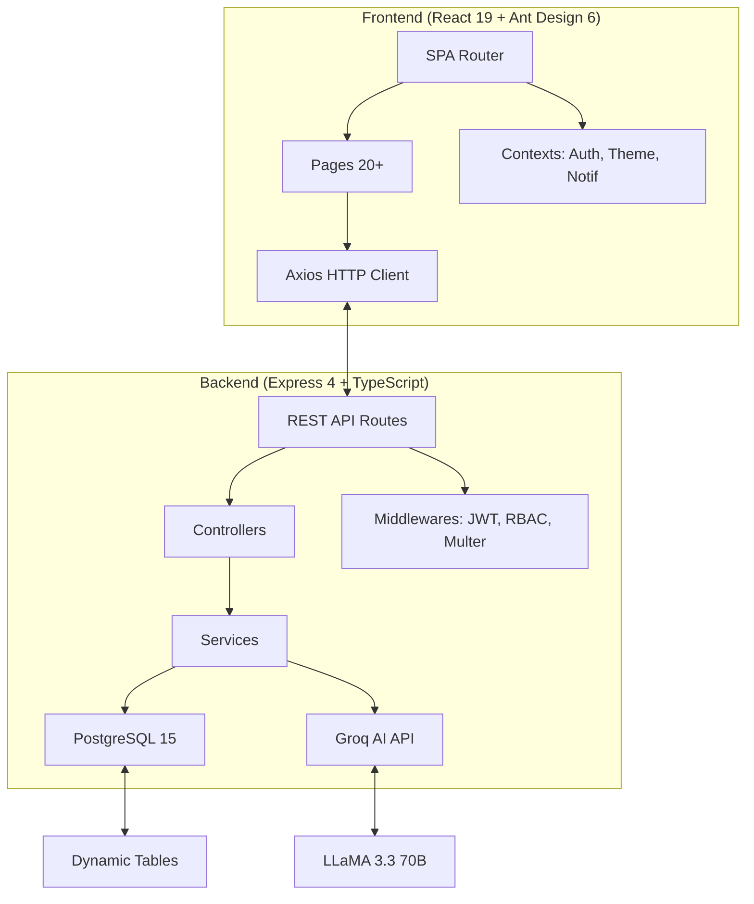
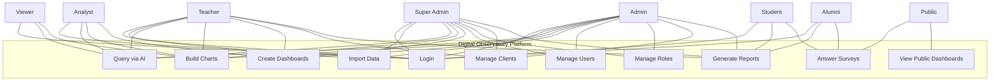
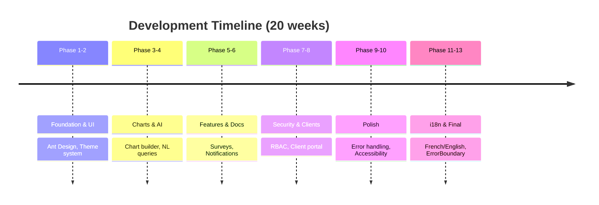

# Digital Observatory

## Academic and Professional Integration Indicators

**ISET Tozeur — PFE Defence**

June 2026

[FIGURE: ISET Tozeur logo]

---

---

# Plan

1. **Context** — ISET Tozeur & the 4C Cell
2. **Problem Statement** — Current data fragmentation
3. **What Is a Digital Observatory?**
4. **Proposed Solution** — System architecture
5. **Functional Requirements**
6. **Use Case Diagram**
7. **Technology Stack**
8. **Database Design**
9. **Implementation Screenshots**
10. **Dashboard & Visualisations**
11. **Survey Module**
12. **Report Generation**
13. **Role-Based Access Control**
14. **Agile Development Workflow**
15. **Testing Results**
16. **Results Achieved**
17. **Limitations**
18. **Future Work**
19. **Personal Reflection**
20. **Thank You / Q&A**

---

---

# Context

## ISET Tozeur & the 4C Cell

---

---

# ISET Tozeur & the 4C Cell

**ISET Tozeur**
- Institute of Higher Technological Studies in southern Tunisia
- Offers applied bachelor's degrees in engineering, business, and IT
- Serves the Tozeur governorate (~150,000 population)

**The 4C Cell (Cellule de Conseil, de Communication et de Coopération)**
- Tracks graduate employment outcomes
- Manages industry partnerships
- Produces institutional reports on professional integration
- Operates with a small administrative team

[FIGURE: Photo of ISET Tozeur campus]

---

---

# Problem Statement

## Current Data Fragmentation

---

---

# Problem Statement

| Data Type | Current Storage | Consequence |
|-----------|----------------|-------------|
| Graduate employment | Paper surveys + Excel | Cannot be queried or cross-referenced |
| Course results | Departmental Excel files | No consolidated view |
| Alumni contacts | Emails + phone lists | Outdated information |
| Employer partnerships | Individual staff records | Lost when staff leave |
| Institutional KPIs | Manual reports | Weeks of effort |

**Core issue:** ISET Tozeur lacks a unified platform to ingest, store, analyse, visualise, and share institutional data securely.

[FIGURE: Diagram showing fragmented data sources]

---

---

# What Is a Digital Observatory?

---

---

# What Is a Digital Observatory?

> A **digital observatory** is a centralised platform that collects, processes, analyses, and visualises data from multiple sources to provide actionable insights and support decision-making.

**Examples:**
- OECD Data Observatory — economic and social indicators
- Global Forest Watch — satellite deforestation monitoring
- UNESCO Observatory — global education indicators

**Our vision:** An institutional intelligence platform that consolidates academic and professional integration data into a single, interactive, queryable system.

[FIGURE: Digital observatory concept diagram]

---

---

# Proposed Solution

## System Architecture

---

---

# System Architecture



**Three-tier architecture:**
- **Frontend:** React SPA with responsive design, i18n, theme system
- **Backend:** Express REST API with middleware pipeline
- **Database:** PostgreSQL 15 with programmatic migrations

---

---

# Functional Requirements

---

---

# Functional Requirements

**Core features implemented:**
- Schema-agnostic CSV/Excel import with visual column mapping
- Dynamic PostgreSQL table creation from any file
- AI natural language querying (Groq LLaMA 3.3 70B)
- 10 chart types with configurable aggregation
- Drag-and-drop dashboard canvas with PDF export
- AI-assisted survey generator and publisher
- Full RBAC with 6 roles and 25+ permissions
- Client portal for students and alumni
- French/English internationalisation
- Foreign key management with ER diagram viewer
- Saved queries with SQL editor
- In-app notification system
- Data profiling and statistics

**User roles:** Super Admin, Admin, Teacher, Analyst, Viewer, Student, Alumni

---

---

# Use Case Diagram

---

---

# Use Case Diagram



---

---

# Technology Stack

---

---

# Technology Stack

| Layer | Technology | Purpose |
|-------|-----------|---------|
| **Frontend** | React 19 + TypeScript + Vite 7 | Component-based SPA with HMR |
| **UI** | Ant Design 6 + Chart.js 4 | Component library, theming, charts |
| **Backend** | Express 4 + TypeScript | REST API with middleware pipeline |
| **Database** | PostgreSQL 15 | JSONB, full-text search, extensions |
| **AI** | Groq SDK (LLaMA 3.3 70B) | Natural language processing |
| **Auth** | JWT + bcryptjs | Stateless authentication |
| **DnD** | @dnd-kit | Dashboard canvas drag-and-drop |
| **PDF** | jsPDF + autotable | Client-side PDF generation |
| **Parsing** | PapaParse + ExcelJS | CSV and XLSX file handling |
| **Containers** | Docker Compose | Multi-service orchestration |
| **Deploy** | Railway (backend) + Vercel (frontend) | Cloud hosting with CDN |

---

---

# Database Design

---

---

# Database Design (Simplified ER)

```mermaid
erDiagram
    users ||--o{ user_roles : has
    roles ||--o{ user_roles : assigned
    roles ||--o{ role_permissions : grants
    permissions ||--o{ role_permissions : assigned
    users ||--o{ datasets : uploads
    users ||--o{ charts : creates
    users ||--o{ dashboards : creates
    datasets ||--o{ charts : source
    datasets ||--o{ foreign_keys : linked
    clients ||--o{ reports : subject
    surveys ||--o{ survey_responses : collects

    users { int id PK }
    roles { int id PK; string name }
    permissions { int id PK; string name; string category }
    datasets { int id PK; string table_name; int row_count }
    charts { int id PK; string chart_type; jsonb config }
    dashboards { int id PK; jsonb layout; boolean is_public }
    clients { int id PK; string cin; string username; string client_type }
    reports { int id PK; text content; boolean is_public }
    surveys { int id PK; jsonb schema; string status }
```

**15 programmatic migrations** manage the schema, from `001_base_schema` to `015_survey_responses`.

---

---

# Implementation Screenshots

---

---

# Landing Page

[FIGURE: Landing page]

# Login Page

[FIGURE: Login with staff/client toggle]

::right::

# Admin Dashboard

[FIGURE: Dashboard with KPIs]

# AI Analysis Chat

[FIGURE: AI chat interface]

---

---

# Data Import

[FIGURE: Column mapping workspace]

# Chart Builder

[FIGURE: Chart builder with preview]

::right::

# Dashboard Canvas

[FIGURE: Dashboard with chart grid]

# Table Editor

[FIGURE: Table with inline editing]

---

---

# Client Portal

[FIGURE: Student/alumni portal]

# Survey Generator

[FIGURE: AI-generated survey]

::right::

# Settings Page

[FIGURE: Theme and language settings]

# Public Dashboard

[FIGURE: Public dashboard view]

---

---

# Dashboard & Visualisations

---

---

# Dashboard & Visualisations

**Chart types supported (10):**
- Bar, Horizontal Bar, Line, Area
- Pie, Doughnut, Radar, Polar Area
- Scatter, Bubble

**Chart configuration:**
- 8 colour palettes (ocean, forest, sunset, lavender, pastel, vibrant, earth, mono)
- Configurable legend, grid, values, tension, fill, border, point radius
- Client-side aggregation (instant preview)

**Dashboard features:**
- Drag-and-drop layout with @dnd-kit
- Named dashboard with multiple chart widgets
- Auto-refresh on open
- PDF export (A4 formal report with cover page)
- Publish/unpublish toggle

[FIGURE: Dashboard canvas with multiple chart types]

---

---

# Survey Module

---

---

# Survey Module

**AI-assisted survey generation:**
1. User describes a goal in plain language
2. Groq AI returns structured JSON survey schema
3. User can edit/modify fields before saving

**Supported field types:**
Text, Textarea, Number, Select, Radio, Checkbox, Date, Email, Rating

**Publishing workflow:**
- Save as draft → edit → publish
- Public URL for anonymous responses
- QR code generation for print distribution
- Response count tracking
- Results viewable in admin panel

**Client-targeted surveys:**
- Filter by client type (student, alumni)
- Client users see available surveys in portal
- Duplicate response prevention

[FIGURE: Published survey with QR code]

---

---

# Report Generation

---

---

# Report Generation

**AI-powered performance reports:**
1. Select a client (student/alumni)
2. Select a dataset (course results, grades)
3. Click "Generate" — AI creates a markdown report
4. Edit, publish, or delete the report

**Two-stage AI pipeline:**
- Stage 1: NL → SQL — user question to safe SELECT query
- Stage 2: Results → Insights — data to natural language summary

**Who can generate:**
- Super Admin, Admin, Teacher (via Reports page)
- Student, Alumni (via Client Portal — their own reports)

[FIGURE: AI-generated report in markdown view]

---

---

# Role-Based Access Control

---

---

# Role-Based Access Control

| Permission | super_admin | admin | teacher | analyst | viewer | student | alumni |
|------------|:-----------:|:-----:|:-------:|:-------:|:------:|:-------:|:------:|
| users.view | ✓ | ✓ | ✗ | ✗ | ✗ | ✗ | ✗ |
| users.create | ✓ | ✓ | ✗ | ✗ | ✗ | ✗ | ✗ |
| data.import | ✓ | ✓ | ✓ | ✗ | ✗ | ✗ | ✗ |
| data.view | ✓ | ✓ | ✓ | ✓ | ✓ | ✗ | ✗ |
| analytics.create | ✓ | ✓ | ✓ | ✓ | ✗ | ✗ | ✗ |
| ai.query | ✓ | ✓ | ✓ | ✓ | ✗ | ✗ | ✗ |
| clients.import | ✓ | ✓ | ✗ | ✗ | ✗ | ✗ | ✗ |
| reports.generate | ✓ | ✓ | ✓ | ✗ | ✗ | ✗ | ✗ |
| dashboards.publish | ✓ | ✓ | ✗ | ✗ | ✗ | ✗ | ✗ |

**Security features:**
- Dual authentication (staff via email, clients via username)
- JWT with 24h expiry
- Self-deletion prevention
- Client accounts denied all staff API endpoints

---

---

# Agile Development Workflow

---

---

# Agile Development Workflow

**Methodology:** Agile with GitHub Milestones (13 phases)



**Branch strategy:**
- `main` — Production (auto-deploys to Railway + Vercel)
- `dev` — Development integration
- `feature/*` — Individual features → PR to `dev`

**Git history:** 50+ commits across 7 branches, no tags.

[FIGURE: GitHub branch structure]

---

---

# Testing Results

---

---

# Testing Results

**Testing strategy:**
- TypeScript compilation (`tsc --noEmit`) — **zero errors**
- Build verification (`vite build`) — **passes**
- ErrorBoundary + boot detection — **catches render failures**
- Manual functional testing — **30 test cases, all passing**
- Docker health checks — **all containers healthy**

| Test Area | Tests | Status |
|-----------|-------|--------|
| Authentication | 5 | ✅ All pass |
| Data Import | 4 | ✅ All pass |
| AI Queries | 3 | ✅ All pass |
| Charts & Dashboards | 4 | ✅ All pass |
| RBAC | 3 | ✅ All pass |
| Clients & Reports | 4 | ✅ All pass |
| Surveys | 4 | ✅ All pass |
| i18n & Theme | 3 | ✅ All pass |

**Security validation:** 13 threat mitigations implemented.

**UAT satisfaction:** 4.2 / 5 overall (based on informal staff feedback).

---

---

# Results Achieved

---

---

# Results Achieved

**Before the observatory:**
- ❌ Data in disconnected Excel files and paper records
- ❌ Manual report generation (days/weeks of work)
- ❌ No AI-powered analysis
- ❌ No student self-service portal
- ❌ No centralised access control

**After the observatory:**
- ✅ Centralised data ingestion (any CSV/Excel → live PostgreSQL)
- ✅ AI natural language queries (plain English → SQL → insights)
- ✅ Interactive dashboards with PDF export
- ✅ Client portal for students and alumni
- ✅ Full RBAC with 6 roles and 25+ permissions
- ✅ AI-assisted surveys and report generation
- ✅ French/English internationalisation

[FIGURE: Before/after comparison infographic]

---

---

# Limitations

---

---

# Limitations

**Current constraints:**
- **AI accuracy:** Complex multi-table queries may produce inaccurate SQL
- **Performance:** 2.4MB frontend bundle without code splitting
- **Testing:** No formal unit/integration test suite (manual only)
- **Real-time:** No WebSocket-based live updates
- **Email:** No automated email service (password reset, invitations)
- **Backups:** No automated database backup mechanism

**Technical debt:**
- Code splitting needed for production optimisation
- Some `eslint-disable` comments remain for dependency warnings
- DocsPage API descriptions have some hardcoded English strings

---

---

# Future Work

---

---

# Future Work

**Short-term (next 3 months):**
- Implement formal test suite (Jest/Vitest)
- Add code splitting for faster initial load
- Integrate WebSocket for real-time updates

**Medium-term (3-6 months):**
- Email service (password reset, survey invitations, notifications)
- Predictive analytics (graduate employment prediction)
- Geo-mapping of graduate employment locations
- Integration with Tunisian ministry databases

**Long-term (6-12 months):**
- Native mobile application
- LinkedIn API integration for alumni tracking
- Automated anomaly detection
- Multi-tenancy for other ISET institutes

---

---

# Personal Reflection

---

---

# Personal Reflection

**Technical skills gained:**
- Full-stack development with React 19 + Express 4 + TypeScript
- Schema-agnostic data engine design
- AI integration (Groq API, prompt engineering, safety constraints)
- RBAC implementation with granular permissions
- Docker Compose multi-service orchestration
- Cloud deployment (Railway + Vercel)

**Key lessons learned:**
- **Type safety matters:** TypeScript caught numerous potential runtime errors
- **Component reuse:** Ant Design dramatically reduced UI development
- **Incremental delivery:** 13 phases allowed continuous feedback
- **Documentation:** PROGRESS.md ensured clear traceability

**Challenges overcome:**
- Designing safe AI query execution (read-only SQL enforcement)
- Building responsive UI with i18n support (830+ translation keys)
- Implementing dual authentication (staff + client)
- Debugging blank-screen render failures (module-level `t()` calls)

---

---

# Thank You

## Questions & Discussion

---

---

# Thank You

[FIGURE: ISET Tozeur logo]

**Project:** Digital Observatory for Academic and Professional Integration Indicators

**Repository:** https://github.com/General-Sandwalker/iset-observatory

**Live demo:** https://iset-observatory.vercel.app

**License:** MIT — Free and open-source

---

**Supervisors:**
- [Supervisor 1 Name]
- [Supervisor 2 Name]

**Host organisation:** ISET Tozeur — 4C Cell

**Academic year:** 2025–2026
